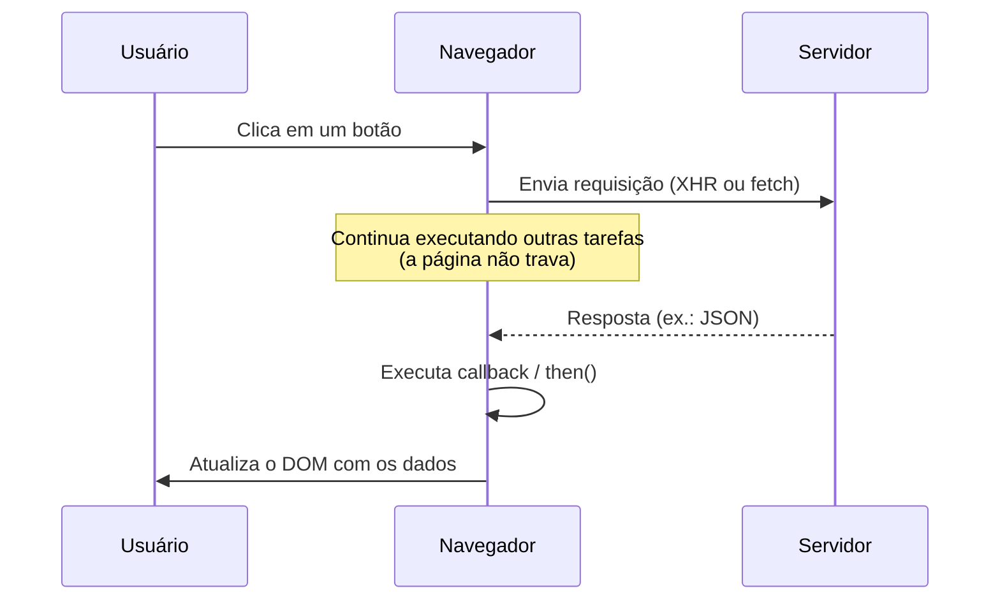

# Asynchronous Javascript and XML (AJaX)

<center>
    <iframe src="https://cpw2.rpmhub.dev/ajax/slides/index.html#/"
        title="Asynchronous Javascript and XML"
        width="90%" height="500" style="border:none;">
    </iframe>
</center>

Ajax, ou Asynchronous JavaScript and XML, é uma técnica de programação que
permite atualizar partes específicas de uma página Web sem recarregar a página
inteira. Isso é feito através do envio de requisições assíncronas para o
servidor, permitindo que o navegador continue interagindo com o usuário
enquanto aguarda a resposta do servidor.
{: .fs-3 }

**Uma analogia:** pense em um garçom em um restaurante. Ele anota o seu
pedido, leva até a cozinha e, enquanto a comida é preparada, continua
atendendo outras mesas — ele não fica parado esperando o prato ficar pronto.
Quando a comida está pronta, ele volta e entrega na sua mesa. É exatamente
isso que uma requisição Ajax faz: o navegador "pede" dados ao servidor e
continua executando outras tarefas (responder a cliques, animações, etc.)
até que a resposta chegue.
{: .fs-3 }

Uma requisição assíncrona é uma requisição que é feita sem interromper o
fluxo de execução do programa. Isso significa que o programa pode continuar
executando outras tarefas enquanto aguarda a resposta do servidor, incluindo
interagir com o usuário, atualizar a interface gráfica da página e/ou realizar
outras requisições.
{: .fs-3 }

O diagrama abaixo resume o fluxo de uma requisição Ajax: o navegador envia a
requisição, continua livre para executar outro código enquanto espera, e só
quando a resposta chega é que uma função de callback é executada para
atualizar o DOM com os dados recebidos.
{: .fs-3 }


{: .fs-3 }

Em JavaScript, você pode usar o objeto `XMLHttpRequest` (XHR) para fazer
requisições Ajax. Aqui está um exemplo básico de como fazer uma requisição Ajax
para recuperar dados, normalmente em JSON (_JavaScript Object Notation_), de um
servidor:
{: .fs-3 }

```javascript
// Criando um objeto XMLHttpRequest
var xhr = new XMLHttpRequest();

// Configurando a requisição (método, URL, assincronismo)
xhr.open('GET', 'http://localhost/api/dados.json', true);

// Definindo a função a ser chamada quando a requisição for concluída
xhr.onload = function() {
  if (xhr.status >= 200 && xhr.status < 300) {
    // Convertendo a resposta para JSON (caso seja JSON)
    var response = JSON.parse(xhr.responseText);
    console.log(response); // Exibindo os dados recebidos
  } else {
    console.error('Erro ao carregar dados: ' + xhr.status);
  }
};

// Enviando a requisição
xhr.send();
```
{: .fs-3 }

Neste exemplo, usamos o método GET para recuperar dados da URL especificada de
forma assíncrona. Quando a resposta é recebida, verificamos o status da resposta
para garantir que a requisição foi bem-sucedida antes de processar os dados.
{: .fs-3 }

O método `open()` é usado para configurar a requisição, especificando o método
HTTP (GET, POST, PUT, DELETE, etc.), a URL do servidor e se a requisição deve
ser assíncrona ou não. O método `send()` é usado para enviar a requisição para o
servidor.
{: .fs-3 }

Já a propriedade `onload` é usada para definir a função a ser chamada quando a
requisição for concluída. Neste caso, verificamos o status da resposta para
garantir que a requisição foi bem-sucedida antes de processar os dados.
{: .fs-3 }

O código de status HTTP 200 indica que a requisição foi bem-sucedida, enquanto
os códigos de status 4xx e 5xx indicam erros na requisição. Se a requisição
falhar, exibimos uma mensagem de erro no console.
{: .fs-3 }

Para entender melhor o que cada propriedade retorna, imagine que o exemplo
anterior tenha sido executado com sucesso. No console do navegador,
poderíamos ver algo assim:
{: .fs-3 }

```text
> xhr.readyState
4                     // requisição concluída

> xhr.status
200                   // sucesso

> xhr.responseText
'{"nome":"Rodrigo","idade":40}'   // texto "cru", como veio do servidor

> response
{ nome: 'Rodrigo', idade: 40 }    // já convertido com JSON.parse()
```
{: .fs-3 }

Finalmente o método `JSON.parse()` é usado para converter a String de resposta
em um objeto JavaScript, caso a resposta seja em JSON.
{: .fs-3 }

## Fetch API

A Fetch API é uma interface moderna para fazer requisições assíncronas em
JavaScript. Ela fornece uma maneira mais simples e poderosa de lidar com
requisições Ajax em comparação com o objeto `XMLHttpRequest`.
{: .fs-3 }

Aqui está um exemplo de como fazer uma requisição usando a Fetch API:
{: .fs-3 }

```javascript
fetch('http://localhost/api/dados.json')
  .then(response => {
    if (!response.ok) {
      throw new Error('Erro ao carregar dados: ' + response.status);
    }
    return response.json();
  })
  .then(data => {
    console.log(data);
  })
  .catch(error => {
    console.error(error);
  });
```
{: .fs-3 }

Neste exemplo, usamos a função `fetch()` para fazer uma requisição GET para a
URL especificada. A função `fetch()` retorna uma Promise que resolve para o
objeto `Response` representando a resposta da requisição.
{: .fs-3 }

Usamos o método `then()` para processar a resposta da requisição. Dentro da
função de callback passada para o método `then()`, verificamos se a resposta foi
bem-sucedida (status 200) e, em seguida, chamamos o método `json()` para
converter a resposta em um objeto JavaScript. Se a requisição falhar, a Promise
é rejeitada e o método `catch()` é chamado para lidar com o erro.
{: .fs-3 }

A Fetch API é mais moderna e fácil de usar do que o objeto `XMLHttpRequest` e
fornece uma maneira mais limpa e concisa de fazer requisições assíncronas em
JavaScript.
{: .fs-3 }

Nota: A Fetch API trabalha por meio de uma Promise, que é um objeto que
representa o resultado de uma operação assíncrona. As Promises são uma maneira
de lidar com operações assíncronas de forma mais limpa e concisa em JavaScript.
Assim, primeiro entenda o conceito de Promises para poder trabalhar com a Fetch
API.
{: .fs-3 }

Para fazer mesma requisição anterior, mas com o método POST, você pode fazer
algo assim:
{: .fs-3 }

```javascript
fetch('http://localhost/api/dados.json', {
  method: 'POST',
  headers: {
    'Content-Type': 'application/json'
  },
  body: JSON.stringify({ key: 'value' })
})
  .then(response => {
    if (!response.ok) {
      throw new Error('Erro ao carregar dados: ' + response.status);
    }
    return response.json();
  })
  .then(data => {
    console.log(data);
  })
  .catch(error => {
    console.error(error);
  });
```
{: .fs-3 }

Neste exemplo, usamos o método `fetch()` para fazer uma requisição POST para a
URL especificada. Passamos um objeto de configuração como segundo argumento para
o método `fetch()`, que contém as opções da requisição, incluindo o método HTTP
(POST), os cabeçalhos da requisição (Content-Type) e o corpo da requisição
(JSON.stringify({ key: 'value' })).
{: .fs-3 }

## XMLHttpRequest ou Fetch?

Agora que vimos as duas formas de fazer requisições Ajax, vale comparar
quando usar cada uma delas:
{: .fs-3 }

| Característica | `XMLHttpRequest` | `fetch()` |
|---|---|---|
| Sintaxe | Mais verbosa, baseada em callbacks (`onload`, `onreadystatechange`) | Mais concisa, baseada em Promises (`.then()`/`.catch()` ou `async`/`await`) |
| Suporte a navegadores antigos | Sim, inclusive Internet Explorer | Não é suportado em navegadores muito antigos |
| Facilidade de uso | Requer mais código para tratar erros e conversão de dados | Já retorna um objeto `Response` fácil de trabalhar com `.json()` |
| Uso recomendado hoje | Projetos legados ou que precisam de suporte a navegadores antigos | Projetos novos, pela simplicidade e por já usar Promises |
{: .fs-3 }

Na prática, em código novo, prefira sempre a Fetch API. O `XMLHttpRequest`
ainda é importante de conhecer porque aparece bastante em código legado e
ajuda a entender os fundamentos de como uma requisição Ajax funciona "por
debaixo dos panos".
{: .fs-3 }

## Exercícios de Fixação Práticos

Os exercícios abaixo são propositalmente simples e incrementais, para você
ganhar confiança com Ajax antes de tentar algo mais complexo. Crie um
arquivo `.txt` e um arquivo `.json` simples no mesmo diretório da sua página
para usar como resposta do servidor.
{: .fs-3 }

1. **Primeira requisição com `XMLHttpRequest`**

    Crie um arquivo `dados.txt` com qualquer texto dentro. Em uma página
    HTML, escreva um script que use `XMLHttpRequest` para fazer um `GET`
    assíncrono a `dados.txt` e, quando a resposta chegar com sucesso
    (`status` 200), exiba o `responseText` dentro de um `<p id="resultado">`.

2. **Lendo um JSON com `XMLHttpRequest`**

    Crie um arquivo `dados.json` com um objeto simples, por exemplo
    `{ "nome": "Rodrigo", "idade": 40 }`. Repita o exercício anterior, mas
    agora use `JSON.parse(xhr.responseText)` para converter a resposta em
    objeto e exiba apenas o valor de `nome` no `<p id="resultado">`.

3. **O mesmo exercício, agora com `fetch()`**

    Refaça o exercício 1 (ler `dados.txt` e exibir o texto), mas usando
    `fetch()` no lugar de `XMLHttpRequest`. Compare as duas versões: qual
    ficou com menos código?

4. **Mostrando "Carregando..." enquanto espera**

    Crie um botão com o texto "Buscar dados". Ao clicar, exiba
    imediatamente a mensagem `"Carregando..."` dentro de um `<p id="status">`
    e, em seguida, dispare uma requisição (com `fetch()` ou
    `XMLHttpRequest`) para `dados.json`. Quando a resposta chegar, substitua
    o texto de `<p id="status">` pelos dados recebidos. Isso ajuda a
    perceber, na prática, que a requisição não bloqueia o restante da
    página.

## Exercício de Fixação Teórico 📚

<center>
    <iframe src="https://cpw2.rpmhub.dev/ajax/slides/questions.html"
        title="Exercício de Fixação Teórico - AJaX" width="90%" height="500"
        style="border:none;">
    </iframe>
</center>

## Referências

* [AJaX Introduction](https://www.w3schools.com/js/js_AJaX_intro.asp) no W3C Schools

* MILETTO, Evandro Manara. [Desenvolvimento de software II: introdução ao desenvolvimento web com html, css, javascript e php](https://biblioteca.ifrs.edu.br/pergamum_ifrs/biblioteca_s/acesso_login.php?cod_acervo_acessibilidade=5020682&acesso=aHR0cHM6Ly9pbnRlZ3JhZGEubWluaGFiaWJsaW90ZWNhLmNvbS5ici9ib29rcy85Nzg4NTgyNjAxOTY5&label=acesso%20restrito). Porto Alegre Bookman 2014 1 recurso online ISBN 9788582601969.

<center>
    <a href="https://rpmhub.dev" target="blanck">
        
    </a>
    <br/>
    <a rel="license" href="http://creativecommons.org/licenses/by/4.0/">
        CC BY 4.0 DEED
    </a>
</center>
