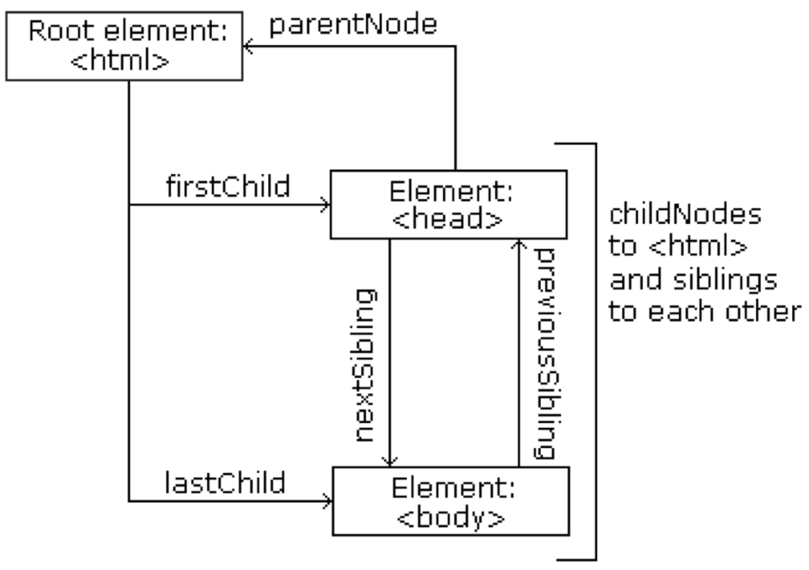

<!-- .slide:  data-background-opacity="0.1" data-background-image="https://miro.medium.com/max/1800/1*6ahbWjp_g9hqhaTDSJOL1Q.png" 
data-transition="convex"  -->
# Document Object Model
<!-- .element: style="margin-bottom:100px; font-size: 60px; color:F5F5F5; font-family: Marker Felt;" -->

Pressione 'F' para tela cheia
<!-- .element: style="font-size: small; font-family: arial; color:#EDEEEC" -->

[versão em pdf](?print-pdf)
<!-- .element: style="font-size: small; font-family: arial; color:#EDEEEC" -->


<!-- .slide: data-background="#4AA791" data-transition="convex"  -->
# Document Object Model
<!-- .element: style="margin-bottom:50px; font-size: 40px; font-family: Marker Felt;" -->

* O Document Object Model (DOM) é um padrão W3C (World Wide Web Consortium)
<!-- .element: style="margin-bottom:50px; font-size: 20px; font-family: arial; color:#EDEEEC" -->

* O DOM define um padrão para o acesso a documentos como HTML e XML
<!-- .element: style="margin-bottom:50px; font-size: 20px; font-family: arial; color:#EDEEEC" -->

* O DOM é uma especificação livre de linguagem. Permite que programas acessem e atualizem dinamicamente o conteúdo, estrutura e estilo de um documento
<!-- .element: style="margin-bottom:50px; font-size: 20px; font-family: arial; color:#EDEEEC" -->

* O DOM é separado em 3 partes distintas / níveis:
<!-- .element: style="margin-bottom:30px; font-size: 20px; font-family: arial; color:#EDEEEC" -->

  * Core - modelo padrão para qualquer documento estruturado
  <!-- .element: style="margin-bottom:30px; font-size: 20px; font-family: arial; color:#EDEEEC" -->

  * XML DOM - modelo padrão para documentos XML
  <!-- .element: style="margin-bottom:30px; font-size: 20px; font-family: arial; color:#EDEEEC" -->

  * HTML DOM - modelo padrão para documentos HTML
  <!-- .element: style="margin-bottom:30px; font-size: 20px; font-family: arial; color:#EDEEEC" -->


<!-- .slide: data-background="#4AA791" data-transition="zoom" color:#EDEEEC" -->
# Document Object Model
<!-- .element: style="margin-bottom:50px; font-size: 40px; font-family: Marker Felt;" -->

* O HTML DOM define:
<!-- .element: style="margin-bottom:30px; font-size: 20px; font-family: arial; color:#EDEEEC" -->

  * Um modelo de objetos padrão para HTML
  <!-- .element: style="margin-bottom:30px; font-size: 20px; font-family: arial; color:#EDEEEC" -->

  * Uma interface de programação padrão para HTML
  <!-- .element: style="margin-bottom:30px; font-size: 20px; font-family: arial; color:#EDEEEC" -->

  * Plataforma independente de linguagem
  <!-- .element: style="margin-bottom:50px; font-size: 20px; font-family: arial; color:#EDEEEC" -->

* O HTML DOM define os objetos e as propriedades de todos os elementos HTML, e os métodos (interface) para acessá-los.
<!-- .element: style="margin-bottom:50px; font-size: 20px; font-family: arial; color:#EDEEEC" -->

* Em outras palavras: O HTML DOM é uma norma para saber como obter, alterar, adicionar ou excluir elementos HTML
<!-- .element: style="margin-bottom:50px; font-size: 20px; font-family: arial; color:#EDEEEC" -->


<!-- .slide: data-background="#4AA791" data-transition="zoom" color:#EDEEEC" -->
# HTML DOM Nodes
<!-- .element: style="margin-bottom:50px; font-size: 40px; font-family: Marker Felt;" -->

* No DOM, tudo em um documento HTML é um node
<!-- .element: style="margin-bottom:50px; font-size: 20px; font-family: arial; color:#EDEEEC" -->

* A especificação do DOM define:
<!-- .element: style="margin-bottom:30px; font-size: 20px; font-family: arial; color:#EDEEEC" -->

  * Todo o documento é um node
  <!-- .element: style="margin-bottom:30px; font-size: 20px; font-family: arial; color:#EDEEEC" -->
  * Cada elemento HTML é um node
  <!-- .element: style="margin-bottom:30px; font-size: 20px; font-family: arial; color:#EDEEEC" -->
  * O texto nos elementos HTML são text nodes
  <!-- .element: style="margin-bottom:30px; font-size: 20px; font-family: arial; color:#EDEEEC" -->
  * Cada atributo é um attribute node
  <!-- .element: style="margin-bottom:30px; font-size: 20px; font-family: arial; color:#EDEEEC" -->
  * Comentários em HTML são nodes
  <!-- .element: style="margin-bottom:30px; font-size: 20px; font-family: arial; color:#EDEEEC" -->


<!-- .slide: data-background="#4AA791" data-transition="zoom" color:#EDEEEC" -->
# Node Exemplo
<!-- .element: style="margin-bottom:50px; font-size: 40px; font-family: Marker Felt;" -->

```html
<html>
  <head>
    <title>DOM Tutorial</title>
  </head>
  <body>
    <h1>DOM Lesson one</h1>
    <p>Hello world!</p>
  </body>
</html>
```
<!-- .element: style="margin-bottom:50px; font-size: 16px; font-family: arial; color:black; background-color: #F2FAF3;" -->


<!-- .slide: data-background="#4AA791" data-transition="zoom" color:#EDEEEC" -->
# Node Exemplo
<!-- .element: style="margin-bottom:50px; font-size: 40px; font-family: Marker Felt;" -->

* A raiz do documento no HTML é `<html>`. Todos os outros nós do documento estão contidos dentro de `<html>`.
<!-- .element: style="margin-bottom:30px; font-size: 20px; font-family: arial; color:#EDEEEC" -->

* O node `<html>` tem dois filhos: `<head>` e `<body>`
<!-- .element: style="margin-bottom:30px; font-size: 20px; font-family: arial; color:#EDEEEC" -->

* O node `<head>` contém apenas um filho: `<title>`
<!-- .element: style="margin-bottom:30px; font-size: 20px; font-family: arial; color:#EDEEEC" -->

* Enquanto o `<body>` contém: `<h1>` e `<p>`
<!-- .element: style="margin-bottom:30px; font-size: 20px; font-family: arial; color:#EDEEEC" -->


<!-- .slide: data-background="#4AA791" data-transition="zoom" color:#EDEEEC" -->
# Text Nodes
<!-- .element: style="margin-bottom:50px; font-size: 40px; font-family: Marker Felt;" -->

* O texto sempre é armazenado em text nodes (nós de texto)
<!-- .element: style="margin-bottom:30px; font-size: 20px; font-family: arial; color:#EDEEEC" -->

* No trecho de código: `<title>` DOM Tutorial `</title>`
<!-- .element: style="margin-bottom:30px; font-size: 20px; font-family: arial; color:#EDEEEC" -->

* O node `<title>`, possui um text node com o valor "DOM Tutorial"
<!-- .element: style="margin-bottom:30px; font-size: 20px; font-family: arial; color:#EDEEEC" -->

* Atenção: “DOM Tutorial” não é o valor de `<title>`
<!-- .element: style="margin-bottom:30px; font-size: 20px; font-family: arial; color:#EDEEEC" -->


<!-- .slide: data-background="#4AA791" data-transition="zoom" color:#EDEEEC" -->
# Representação Gráfica do Exemplo
<!-- .element: style="margin-bottom:50px; font-size: 40px; font-family: Marker Felt;" -->

<center>

</center>


<!-- .slide: data-background="#4AA791" data-transition="zoom" color:#EDEEEC" -->
# HTML Node Tree
<!-- .element: style="margin-bottom:50px; font-size: 40px; font-family: Marker Felt;" -->

* Um documento em HTML possui uma estrutura no formato de uma árvore. Esta estrutura é chamada de node-tree
<!-- .element: style="margin-bottom:30px; font-size: 20px; font-family: arial; color:#EDEEEC" -->

* Assim, todos os nós podem ser acessados através da árvore
<!-- .element: style="margin-bottom:30px; font-size: 20px; font-family: arial; color:#EDEEEC" -->

* Consequentemente, seu conteúdo pode ser modificado ou excluído, e novos elementos podem ser criados
<!-- .element: style="margin-bottom:30px; font-size: 20px; font-family: arial; color:#EDEEEC" -->


<!-- .slide: data-background="#4AA791" data-transition="zoom" color:#EDEEEC" -->
# Parents, Children e Siblings
<!-- .element: style="margin-bottom:50px; font-size: 40px; font-family: Marker Felt;" -->

* Os nós na árvore possuem uma relação hierárquica
<!-- .element: style="margin-bottom:30px; font-size: 20px; font-family: arial; color:#EDEEEC" -->

* Os termos parent (pai), child (filho) e sibling (irmão) são usados para descrever as relações
<!-- .element: style="margin-bottom:30px; font-size: 20px; font-family: arial; color:#EDEEEC" -->

* Desta forma os nós pais possuem filhos. Bem como nós no mesmo nível são chamados de irmãos
<!-- .element: style="margin-bottom:30px; font-size: 20px; font-family: arial; color:#EDEEEC" -->


<!-- .slide: data-background="#4AA791" data-transition="zoom" color:#EDEEEC" -->
# Parents, Children e Siblings
<!-- .element: style="margin-bottom:50px; font-size: 40px; font-family: Marker Felt;" -->




<!-- .slide: data-background="#4AA791" data-transition="zoom" color:#EDEEEC" -->
# HTML Node Tree
<!-- .element: style="margin-bottom:50px; font-size: 40px; font-family: Marker Felt;" -->

* Numa árvore, o nó superior é chamado de root (raiz)
<!-- .element: style="margin-bottom:30px; font-size: 20px; font-family: arial; color:#EDEEEC" -->

* Cada nó, exceto a raiz, possui exatamente um pai
<!-- .element: style="margin-bottom:30px; font-size: 20px; font-family: arial; color:#EDEEEC" -->

* Um nó pode ter vários filhos
<!-- .element: style="margin-bottom:30px; font-size: 20px; font-family: arial; color:#EDEEEC" -->

* Irmãos são nós com o mesmo pai
<!-- .element: style="margin-bottom:30px; font-size: 20px; font-family: arial; color:#EDEEEC" -->

* Uma folha é um nó sem filhos
<!-- .element: style="margin-bottom:30px; font-size: 20px; font-family: arial; color:#EDEEEC" -->


<!-- .slide: data-background="#4AA791" data-transition="zoom" color:#EDEEEC" -->
# Interface de Programação
<!-- .element: style="margin-bottom:50px; font-size: 40px; font-family: Marker Felt;" -->

* A interface de programação do DOM é definida pelas propriedades e métodos
<!-- .element: style="margin-bottom:50px; font-size: 20px; font-family: arial; color:#EDEEEC" -->

* As propriedades são os valores (dados) internos de um nó (nome, pai, filho, etc.)
<!-- .element: style="margin-bottom:50px; font-size: 20px; font-family: arial; color:#EDEEEC" -->

* Os métodos são as ações que você pode realizar com um nó (procurar, inserir, remover, etc.)
<!-- .element: style="margin-bottom:50px; font-size: 20px; font-family: arial; color:#EDEEEC" -->


<!-- .slide: data-background="#4AA791" data-transition="zoom" color:#EDEEEC" -->
# Exemplos de Propriedades
<!-- .element: style="margin-bottom:50px; font-size: 40px; font-family: Marker Felt;" -->

* Dado que x é um nó da árvore:
  <!-- .element: style="margin-bottom:30px; font-size: 20px; font-family: arial; color:#EDEEEC" -->

    * x.innerHTML - o valor de texto de x
    <!-- .element: style="margin-bottom:30px; font-size: 20px; font-family: arial; color:#EDEEEC" -->

    * x.nodeName - o nome x
    <!-- .element: style="margin-bottom:30px; font-size: 20px; font-family: arial; color:#EDEEEC" -->

    * x.nodeValue - o valor de x
    <!-- .element: style="margin-bottom:30px; font-size: 20px; font-family: arial; color:#EDEEEC" -->

    * x.parentNode - o nó pai de x
    <!-- .element: style="margin-bottom:30px; font-size: 20px; font-family: arial; color:#EDEEEC" -->

    * x.childNodes - os nós filho de x
    <!-- .element: style="margin-bottom:30px; font-size: 20px; font-family: arial; color:#EDEEEC" -->

    * x.attributes - os atributos dos nodos x
    <!-- .element: style="margin-bottom:30px; font-size: 20px; font-family: arial; color:#EDEEEC" -->


<!-- .slide: data-background="#4AA791" data-transition="zoom" color:#EDEEEC" -->
# Métodos
<!-- .element: style="margin-bottom:50px; font-size: 40px; font-family: Marker Felt;" -->

* Dado que x é um nó da árvore:
<!-- .element: style="margin-bottom:30px; font-size: 20px; font-family: arial; color:#EDEEEC" -->

  * x.getElementById("id") - obtém o elemento com um id específico
  <!-- .element: style="margin-bottom:30px; font-size: 20px; font-family: arial; color:#EDEEEC" -->

  * x.getElementsByTagName("name") - obter todos os elementos de uma determinada tag
  <!-- .element: style="margin-bottom:30px; font-size: 20px; font-family: arial; color:#EDEEEC" -->

  * x.appendChild(node) - inserir um filho para x
  <!-- .element: style="margin-bottom:30px; font-size: 20px; font-family: arial; color:#EDEEEC" -->

  * x.removeChild(node) - remove um filho de x
  <!-- .element: style="margin-bottom:30px; font-size: 20px; font-family: arial; color:#EDEEEC" -->


<!-- .slide: data-background="#4AA791" data-transition="zoom" color:#EDEEEC" -->
# A propriedade innerHTML
<!-- .element: style="margin-bottom:50px; font-size: 40px; font-family: Marker Felt;" -->

* A maneira mais fácil de obter ou modificar o conteúdo de um elemento é usando a propriedade innerHTML
<!-- .element: style="margin-bottom:50px; font-size: 20px; font-family: arial; color:#EDEEEC" -->

* Esta propriedade não é uma parte da especificação do DOM do W3C. No entanto, é suportada por todos os principais navegadores
<!-- .element: style="margin-bottom:50px; font-size: 20px; font-family: arial; color:#EDEEEC" -->

* A propriedade innerHTML é útil para a devolução ou substituição do conteúdo nos elementos HTML
<!-- .element: style="margin-bottom:50px; font-size: 20px; font-family: arial; color:#EDEEEC" -->


<!-- .slide: data-background="#4AA791" data-transition="zoom" color:#EDEEEC" -->
# A propriedade innerHTML
<!-- .element: style="margin-bottom:50px; font-size: 40px; font-family: Marker Felt;" -->

```html
<html>
    <body>
        <p id="intro">Hello World!</p>

        <script type="text/javascript">
            var txt = document.getElementById("intro").innerHTML;
            document.write("<p>O texto do parágrafo é: " + txt + "</p>");
        </script>
    </body>
</html>
```
<!-- .element: style="margin-bottom:50px; font-size: 16px; font-family: arial; color:black; background-color: #F2FAF3;" -->


<!-- .slide: data-background="#4AA791" data-transition="zoom" color:#EDEEEC" -->
# childNodes e nodeValue
<!-- .element: style="margin-bottom:50px; font-size: 40px; font-family: Marker Felt;" -->

* Podemos também recuperar o valor do parágrafo por meio das propriedades childNodes e nodeValue
<!-- .element: style="margin-bottom:50px; font-size: 20px; font-family: arial; color:#EDEEEC" -->

```html
<html>
    <body>
        <p id="intro">Hello World!</p>

        <script type="text/javascript">
            var txt=document.getElementById("intro").childNodes[0].nodeValue;
            document.write("<p>O texto do parágrafo é:" + txt + "</p>");
        </script>
    </body>
</html>
```
<!-- .element: style="margin-bottom:50px; font-size: 16px; font-family: arial; color:black; background-color: #F2FAF3;" -->


<!-- .slide: data-background="#4AA791" data-transition="zoom" color:#EDEEEC" -->
# HTML DOM Access Nodes
<!-- .element: style="margin-bottom:50px; font-size: 40px; font-family: Marker Felt;" -->

* Você pode acessar um nó de três maneiras:
<!-- .element: style="margin-bottom:30px; font-size: 20px; font-family: arial; color:#EDEEEC" -->

  * Usando o método getElementById()
  <!-- .element: style="margin-bottom:30px; font-size: 20px; font-family: arial; color:#EDEEEC" -->

  * Utilizando o método getElementsByTagName()
  <!-- .element: style="margin-bottom:30px; font-size: 20px; font-family: arial; color:#EDEEEC" -->

  * Navegando na árvore
  <!-- .element: style="margin-bottom:30px; font-size: 20px; font-family: arial; color:#EDEEEC" -->


<!-- .slide: data-background="#4AA791" data-transition="zoom" color:#EDEEEC" -->
# O Método getElementById()
<!-- .element: style="margin-bottom:50px; font-size: 40px; font-family: Marker Felt;" -->

* O método getElementById() retorna o elemento com o ID especificado
<!-- .element: style="margin-bottom:50px; font-size: 20px; font-family: arial; color:#EDEEEC" -->

```html
<html>
    <body>
        <p id="intro">Hello World!</p>

        <script type="text/javascript">
            // x é um elemento do HTML
            var x = document.getElementById("intro");
            document.write("<p>" + x.innerHTML + "</p>");
        </script>
    </body>
</html>
```
<!-- .element: style="margin-bottom:50px; font-size: 16px; font-family: arial; color:black; background-color: #F2FAF3;" -->


<!-- .slide: data-background="#4AA791" data-transition="zoom" color:#EDEEEC" -->
# O Método getElementsByTagName()
<!-- .element: style="margin-bottom:50px; font-size: 40px; font-family: Marker Felt;" -->

* O método getElementsByTagName() retorna todas as tags de mesmo nome (node-list)
<!-- .element: style="margin-bottom:50px; font-size: 20px; font-family: arial; color:#EDEEEC" -->

```html
<html>
    <body>
        <p>Hello</p>
        <p>World!</p>

        <script type="text/javascript">
            x=document.getElementsByTagName("p");
            // Atenção: x é um node list
            document.write("Texto do segundo parágrafo: " + x[1].innerHTML);
        </script>
    </body>
</html>
```
<!-- .element: style="margin-bottom:50px; font-size: 16px; font-family: arial; color:black; background-color: #F2FAF3;" -->


<!-- .slide: data-background="#4AA791" data-transition="zoom" color:#EDEEEC" -->
# Navegando na Árvore
<!-- .element: style="margin-bottom:50px; font-size: 40px; font-family: Marker Felt;" -->

* As propriedades; parentNode, firstChild e lastChild, permitem viagens de curta distância em um documento
<!-- .element: style="margin-bottom:50px; font-size: 20px; font-family: arial; color:#EDEEEC" -->

```html
<html>
    <body>
        <p id="intro">Hello World!</p>

        <script type="text/javascript">
            x = document.getElementById("intro");
            document.write(x.firstChild.nodeValue);
        </script>
    </body>
</html>
```
<!-- .element: style="margin-bottom:50px; font-size: 16px; font-family: arial; color:black; background-color: #F2FAF3;" -->


<!-- .slide: data-background="#4AA791" data-transition="zoom" color:#EDEEEC" -->
# Referências
<!-- .element: style="margin-bottom:50px; font-size: 45px; font-family: Marker Felt;" -->

* W3schools: [DOM Tutorial](https://www.w3schools.com/js/js_htmldom.asp)
<!-- .element: style="margin-bottom:50px; font-size: 20px; font-family: arial; color:#EDEEEC" -->

* MILETTO, Evandro Manara. [Desenvolvimento de software II: introdução ao desenvolvimento web com html, css, javascript e php](https://biblioteca.ifrs.edu.br/pergamum_ifrs/biblioteca_s/acesso_login.php?cod_acervo_acessibilidade=5020682&acesso=aHR0cHM6Ly9pbnRlZ3JhZGEubWluaGFiaWJsaW90ZWNhLmNvbS5ici9ib29rcy85Nzg4NTgyNjAxOTY5&label=acesso%20restrito). Porto Alegre Bookman 2014 1 recurso online ISBN 9788582601969.
<!-- .element: style="margin-bottom:70px; font-size: 20px; font-family: arial; color:#EDEEEC" -->

<center>
<a href="https://github.com/rodrigoprestesmachado" target="blanck"></a><br/>
<a rel="license" href="http://creativecommons.org/licenses/by/4.0/">Creative Commons Atribuição 4.0 Internacional</a>
<!-- .element: style="margin-bottom:50px; font-size: 14px; font-family: arial; color:#EDEEEC" -->