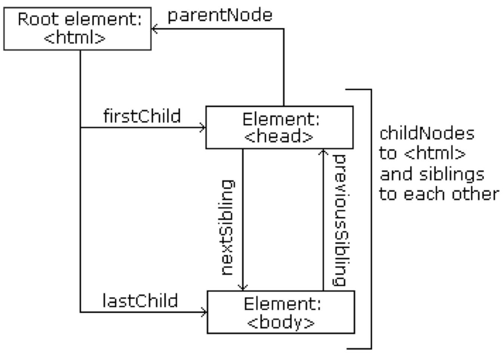

<!-- .slide:  data-background-opacity="0.3" data-background-image="imgs/title.jpg" data-transition="convex"  -->
# Document Object Model
<!-- .element: style="margin-bottom:100px; font-size: 60px; color:F5F5F5; font-family: Marker Felt;" -->

Pressione 'F' para tela cheia
<!-- .element: style="font-size: small; font-family: arial; color:#EDEEEC" -->

[versão em pdf](?print-pdf)
<!-- .element: style="font-size: small; font-family: arial; color:#EDEEEC" -->


<!-- .slide: data-background="#4AA791" data-transition="convex"  -->
# Document Object Model
<!-- .element: style="margin-bottom:50px; font-size: 40px; font-family: Marker Felt;" -->

* O Document Object Model (DOM) é um padrão do W3C (World Wide Web Consortium)
<!-- .element: style="margin-bottom:50px; font-size: 20px; font-family: arial; color:#EDEEEC" -->

* Ele define como programas podem acessar e atualizar documentos como HTML e XML
<!-- .element: style="margin-bottom:50px; font-size: 20px; font-family: arial; color:#EDEEEC" -->

* É uma especificação livre de linguagem: permite atualizar dinamicamente conteúdo, estrutura e estilo de um documento
<!-- .element: style="margin-bottom:50px; font-size: 20px; font-family: arial; color:#EDEEEC" -->

* O DOM é dividido em 3 partes (níveis):
<!-- .element: style="margin-bottom:30px; font-size: 20px; font-family: arial; color:#EDEEEC" -->

  * Core: modelo padrão para qualquer documento estruturado
  <!-- .element: style="margin-bottom:30px; font-size: 20px; font-family: arial; color:#EDEEEC" -->

  * XML DOM: modelo padrão para documentos XML
  <!-- .element: style="margin-bottom:30px; font-size: 20px; font-family: arial; color:#EDEEEC" -->

  * HTML DOM: modelo padrão para documentos HTML
  <!-- .element: style="margin-bottom:30px; font-size: 20px; font-family: arial; color:#EDEEEC" -->


<!-- .slide: data-background="#4AA791" data-transition="zoom" color:#EDEEEC" -->
# Document Object Model
<!-- .element: style="margin-bottom:50px; font-size: 40px; font-family: Marker Felt;" -->

* O HTML DOM define:
<!-- .element: style="margin-bottom:30px; font-size: 20px; font-family: arial; color:#EDEEEC" -->

  * Um modelo de objetos padrão para HTML
  <!-- .element: style="margin-bottom:30px; font-size: 20px; font-family: arial; color:#EDEEEC" -->

  * Uma interface de programação padrão para HTML
  <!-- .element: style="margin-bottom:30px; font-size: 20px; font-family: arial; color:#EDEEEC" -->

  * Uma plataforma independente de linguagem
  <!-- .element: style="margin-bottom:50px; font-size: 20px; font-family: arial; color:#EDEEEC" -->

* Ele define os objetos e as propriedades de todos os elementos HTML, além dos métodos (interface) para acessá-los
<!-- .element: style="margin-bottom:50px; font-size: 20px; font-family: arial; color:#EDEEEC" -->

* Em outras palavras: o HTML DOM é uma norma para saber como obter, alterar, adicionar ou excluir elementos HTML
<!-- .element: style="margin-bottom:50px; font-size: 20px; font-family: arial; color:#EDEEEC" -->


<!-- .slide: data-background="#4AA791" data-transition="zoom" color:#EDEEEC" -->
# HTML DOM Nodes
<!-- .element: style="margin-bottom:50px; font-size: 40px; font-family: Marker Felt;" -->

* No DOM, tudo em um documento HTML é um node (nó)
<!-- .element: style="margin-bottom:50px; font-size: 20px; font-family: arial; color:#EDEEEC" -->

* A especificação do DOM define:
<!-- .element: style="margin-bottom:30px; font-size: 20px; font-family: arial; color:#EDEEEC" -->

  * O documento inteiro é um node
  <!-- .element: style="margin-bottom:30px; font-size: 20px; font-family: arial; color:#EDEEEC" -->
  * Cada elemento HTML é um node
  <!-- .element: style="margin-bottom:30px; font-size: 20px; font-family: arial; color:#EDEEEC" -->
  * O texto dentro dos elementos HTML forma text nodes (nós de texto)
  <!-- .element: style="margin-bottom:30px; font-size: 20px; font-family: arial; color:#EDEEEC" -->
  * Cada atributo é um attribute node (nó de atributo)
  <!-- .element: style="margin-bottom:30px; font-size: 20px; font-family: arial; color:#EDEEEC" -->
  * Comentários em HTML também são nodes
  <!-- .element: style="margin-bottom:30px; font-size: 20px; font-family: arial; color:#EDEEEC" -->


<!-- .slide: data-background="#4AA791" data-transition="zoom" color:#EDEEEC" -->
# Node: Exemplo
<!-- .element: style="margin-bottom:50px; font-size: 40px; font-family: Marker Felt;" -->

```html
<html>
  <head>
    <title>DOM Tutorial</title>
  </head>
  <body>
    <h1>DOM Lesson one</h1>
    <p>Hello world!</p>
  </body>
</html>
```
<!-- .element: style="margin-bottom:50px; font-size: 16px; font-family: arial; color:black; background-color: #F2FAF3;" -->


<!-- .slide: data-background="#4AA791" data-transition="zoom" color:#EDEEEC" -->
# Node: Exemplo
<!-- .element: style="margin-bottom:50px; font-size: 40px; font-family: Marker Felt;" -->

* A raiz do documento HTML é `<html>`. Todos os outros nós ficam dentro dele
<!-- .element: style="margin-bottom:30px; font-size: 20px; font-family: arial; color:#EDEEEC" -->

* O node `<html>` tem dois filhos: `<head>` e `<body>`
<!-- .element: style="margin-bottom:30px; font-size: 20px; font-family: arial; color:#EDEEEC" -->

* O node `<head>` contém apenas um filho: `<title>`
<!-- .element: style="margin-bottom:30px; font-size: 20px; font-family: arial; color:#EDEEEC" -->

* Já o `<body>` contém dois filhos: `<h1>` e `<p>`
<!-- .element: style="margin-bottom:30px; font-size: 20px; font-family: arial; color:#EDEEEC" -->


<!-- .slide: data-background="#4AA791" data-transition="zoom" color:#EDEEEC" -->
# Text Nodes
<!-- .element: style="margin-bottom:50px; font-size: 40px; font-family: Marker Felt;" -->

* O texto de um elemento sempre é armazenado em um text node (nó de texto), separado do próprio elemento
<!-- .element: style="margin-bottom:30px; font-size: 20px; font-family: arial; color:#EDEEEC" -->

* No trecho `<title>DOM Tutorial</title>`, o node `<title>` possui um text node filho com o valor "DOM Tutorial"
<!-- .element: style="margin-bottom:30px; font-size: 20px; font-family: arial; color:#EDEEEC" -->

* Atenção: "DOM Tutorial" não é o valor de `<title>`, e sim o valor do text node contido nele
<!-- .element: style="margin-bottom:30px; font-size: 20px; font-family: arial; color:#EDEEEC" -->


<!-- .slide: data-background="#4AA791" data-transition="zoom" color:#EDEEEC" -->
# Representação Gráfica do Exemplo
<!-- .element: style="margin-bottom:50px; font-size: 40px; font-family: Marker Felt;" -->

<center>

</center>


<!-- .slide: data-background="#4AA791" data-transition="zoom" color:#EDEEEC" -->
# HTML Node Tree
<!-- .element: style="margin-bottom:50px; font-size: 40px; font-family: Marker Felt;" -->

* Um documento HTML tem uma estrutura em formato de árvore, chamada de node-tree (árvore de nós)
<!-- .element: style="margin-bottom:30px; font-size: 20px; font-family: arial; color:#EDEEEC" -->

* Todos os nós podem ser acessados percorrendo essa árvore
<!-- .element: style="margin-bottom:30px; font-size: 20px; font-family: arial; color:#EDEEEC" -->

* Por isso, seu conteúdo pode ser modificado, excluído, e novos elementos podem ser criados dinamicamente
<!-- .element: style="margin-bottom:30px; font-size: 20px; font-family: arial; color:#EDEEEC" -->


<!-- .slide: data-background="#4AA791" data-transition="zoom" color:#EDEEEC" -->
# Parents, Children e Siblings
<!-- .element: style="margin-bottom:50px; font-size: 40px; font-family: Marker Felt;" -->

* Os nós na árvore possuem uma relação hierárquica entre si
<!-- .element: style="margin-bottom:30px; font-size: 20px; font-family: arial; color:#EDEEEC" -->

* Os termos parent (pai), child (filho) e sibling (irmão) descrevem essas relações
<!-- .element: style="margin-bottom:30px; font-size: 20px; font-family: arial; color:#EDEEEC" -->

* Um nó pai possui filhos, e nós que compartilham o mesmo pai são chamados de irmãos
<!-- .element: style="margin-bottom:30px; font-size: 20px; font-family: arial; color:#EDEEEC" -->


<!-- .slide: data-background="#4AA791" data-transition="zoom" color:#EDEEEC" -->
# Parents, Children e Siblings
<!-- .element: style="margin-bottom:50px; font-size: 40px; font-family: Marker Felt;" -->




<!-- .slide: data-background="#4AA791" data-transition="zoom" color:#EDEEEC" -->
# HTML Node Tree
<!-- .element: style="margin-bottom:50px; font-size: 40px; font-family: Marker Felt;" -->

* Numa árvore, o nó do topo é chamado de root (raiz)
<!-- .element: style="margin-bottom:30px; font-size: 20px; font-family: arial; color:#EDEEEC" -->

* Cada nó, exceto a raiz, possui exatamente um pai
<!-- .element: style="margin-bottom:30px; font-size: 20px; font-family: arial; color:#EDEEEC" -->

* Um nó pode ter vários filhos
<!-- .element: style="margin-bottom:30px; font-size: 20px; font-family: arial; color:#EDEEEC" -->

* Irmãos (siblings) são nós que possuem o mesmo pai
<!-- .element: style="margin-bottom:30px; font-size: 20px; font-family: arial; color:#EDEEEC" -->

* Uma folha é um nó sem filhos
<!-- .element: style="margin-bottom:30px; font-size: 20px; font-family: arial; color:#EDEEEC" -->


<!-- .slide: data-background="#4AA791" data-transition="zoom" color:#EDEEEC" -->
# Interface de Programação
<!-- .element: style="margin-bottom:50px; font-size: 40px; font-family: Marker Felt;" -->

* A interface de programação do DOM é definida por propriedades e métodos
<!-- .element: style="margin-bottom:50px; font-size: 20px; font-family: arial; color:#EDEEEC" -->

* Propriedades são os valores (dados) internos de um nó, como nome, pai e filhos
<!-- .element: style="margin-bottom:50px; font-size: 20px; font-family: arial; color:#EDEEEC" -->

* Métodos são as ações que podemos realizar em um nó, como procurar, inserir e remover
<!-- .element: style="margin-bottom:50px; font-size: 20px; font-family: arial; color:#EDEEEC" -->


<!-- .slide: data-background="#4AA791" data-transition="zoom" color:#EDEEEC" -->
# Exemplos de Propriedades
<!-- .element: style="margin-bottom:50px; font-size: 40px; font-family: Marker Felt;" -->

* Considerando que `x` é um nó da árvore:
  <!-- .element: style="margin-bottom:30px; font-size: 20px; font-family: arial; color:#EDEEEC" -->

    * `x.innerHTML`: retorna ou define o conteúdo (texto/HTML) de x
    <!-- .element: style="margin-bottom:30px; font-size: 20px; font-family: arial; color:#EDEEEC" -->

    * `x.nodeName`: retorna o nome de x
    <!-- .element: style="margin-bottom:30px; font-size: 20px; font-family: arial; color:#EDEEEC" -->

    * `x.nodeValue`: retorna o valor de x
    <!-- .element: style="margin-bottom:30px; font-size: 20px; font-family: arial; color:#EDEEEC" -->

    * `x.parentNode`: retorna o nó pai de x
    <!-- .element: style="margin-bottom:30px; font-size: 20px; font-family: arial; color:#EDEEEC" -->

    * `x.childNodes`: retorna os nós filhos de x
    <!-- .element: style="margin-bottom:30px; font-size: 20px; font-family: arial; color:#EDEEEC" -->

    * `x.attributes`: retorna os atributos de x
    <!-- .element: style="margin-bottom:30px; font-size: 20px; font-family: arial; color:#EDEEEC" -->


<!-- .slide: data-background="#4AA791" data-transition="zoom" color:#EDEEEC" -->
# Métodos
<!-- .element: style="margin-bottom:50px; font-size: 40px; font-family: Marker Felt;" -->

* Considerando que `x` é um nó da árvore:
<!-- .element: style="margin-bottom:30px; font-size: 20px; font-family: arial; color:#EDEEEC" -->

  * `x.getElementById("id")`: obtém o elemento com o id especificado
  <!-- .element: style="margin-bottom:30px; font-size: 20px; font-family: arial; color:#EDEEEC" -->

  * `x.getElementsByTagName("name")`: obtém todos os elementos de uma determinada tag
  <!-- .element: style="margin-bottom:30px; font-size: 20px; font-family: arial; color:#EDEEEC" -->

  * `x.appendChild(node)`: insere um novo filho em x
  <!-- .element: style="margin-bottom:30px; font-size: 20px; font-family: arial; color:#EDEEEC" -->

  * `x.removeChild(node)`: remove um filho de x
  <!-- .element: style="margin-bottom:30px; font-size: 20px; font-family: arial; color:#EDEEEC" -->


<!-- .slide: data-background="#4AA791" data-transition="zoom" color:#EDEEEC" -->
# A propriedade innerHTML
<!-- .element: style="margin-bottom:50px; font-size: 40px; font-family: Marker Felt;" -->

* A forma mais simples de ler ou alterar o conteúdo de um elemento é usando a propriedade innerHTML
<!-- .element: style="margin-bottom:50px; font-size: 20px; font-family: arial; color:#EDEEEC" -->

* Ela não faz parte da especificação oficial do DOM do W3C, mas é suportada por todos os navegadores modernos
<!-- .element: style="margin-bottom:50px; font-size: 20px; font-family: arial; color:#EDEEEC" -->

* A propriedade innerHTML é útil tanto para obter quanto para substituir o conteúdo de elementos HTML
<!-- .element: style="margin-bottom:50px; font-size: 20px; font-family: arial; color:#EDEEEC" -->


<!-- .slide: data-background="#4AA791" data-transition="zoom" color:#EDEEEC" -->
# A propriedade innerHTML
<!-- .element: style="margin-bottom:50px; font-size: 40px; font-family: Marker Felt;" -->

```html
<html>
    <body>
        <p id="intro">Hello World!</p>

        <script type="text/javascript">
            var txt = document.getElementById("intro").innerHTML;
            document.write("<p>O texto do parágrafo é: " + txt + "</p>");
        </script>
    </body>
</html>
```
<!-- .element: style="margin-bottom:50px; font-size: 16px; font-family: arial; color:black; background-color: #F2FAF3;" -->


<!-- .slide: data-background="#4AA791" data-transition="zoom" color:#EDEEEC" -->
# childNodes e nodeValue
<!-- .element: style="margin-bottom:50px; font-size: 40px; font-family: Marker Felt;" -->

* Também é possível obter o valor do parágrafo combinando as propriedades childNodes e nodeValue
<!-- .element: style="margin-bottom:50px; font-size: 20px; font-family: arial; color:#EDEEEC" -->

```html
<html>
    <body>
        <p id="intro">Hello World!</p>

        <script type="text/javascript">
            var txt = document.getElementById("intro").childNodes[0].nodeValue;
            document.write("<p>O texto do parágrafo é: " + txt + "</p>");
        </script>
    </body>
</html>
```
<!-- .element: style="margin-bottom:50px; font-size: 16px; font-family: arial; color:black; background-color: #F2FAF3;" -->


<!-- .slide: data-background="#4AA791" data-transition="zoom" color:#EDEEEC" -->
# HTML DOM Access Nodes
<!-- .element: style="margin-bottom:50px; font-size: 40px; font-family: Marker Felt;" -->

* É possível acessar um nó de três formas diferentes:
<!-- .element: style="margin-bottom:30px; font-size: 20px; font-family: arial; color:#EDEEEC" -->

  * Usando o método getElementById()
  <!-- .element: style="margin-bottom:30px; font-size: 20px; font-family: arial; color:#EDEEEC" -->

  * Usando o método getElementsByTagName()
  <!-- .element: style="margin-bottom:30px; font-size: 20px; font-family: arial; color:#EDEEEC" -->

  * Navegando pela árvore de nós
  <!-- .element: style="margin-bottom:30px; font-size: 20px; font-family: arial; color:#EDEEEC" -->


<!-- .slide: data-background="#4AA791" data-transition="zoom" color:#EDEEEC" -->
# O Método getElementById()
<!-- .element: style="margin-bottom:50px; font-size: 40px; font-family: Marker Felt;" -->

* O método getElementById() retorna o elemento com o id especificado
<!-- .element: style="margin-bottom:50px; font-size: 20px; font-family: arial; color:#EDEEEC" -->

```html
<html>
    <body>
        <p id="intro">Hello World!</p>

        <script type="text/javascript">
            // x é um elemento do HTML
            var x = document.getElementById("intro");
            document.write("<p>" + x.innerHTML + "</p>");
        </script>
    </body>
</html>
```
<!-- .element: style="margin-bottom:50px; font-size: 16px; font-family: arial; color:black; background-color: #F2FAF3;" -->


<!-- .slide: data-background="#4AA791" data-transition="zoom" color:#EDEEEC" -->
# O Método getElementsByTagName()
<!-- .element: style="margin-bottom:50px; font-size: 40px; font-family: Marker Felt;" -->

* O método getElementsByTagName() retorna todos os elementos com a mesma tag, em uma node-list (lista de nós)
<!-- .element: style="margin-bottom:50px; font-size: 20px; font-family: arial; color:#EDEEEC" -->

```html
<html>
    <body>
        <p>Hello</p>
        <p>World!</p>

        <script type="text/javascript">
            var x = document.getElementsByTagName("p");
            // atenção: x é uma node-list, não um array comum
            document.write("Texto do segundo parágrafo: " + x[1].innerHTML);
        </script>
    </body>
</html>
```
<!-- .element: style="margin-bottom:50px; font-size: 16px; font-family: arial; color:black; background-color: #F2FAF3;" -->


<!-- .slide: data-background="#4AA791" data-transition="zoom" color:#EDEEEC" -->
# Navegando na Árvore
<!-- .element: style="margin-bottom:50px; font-size: 40px; font-family: Marker Felt;" -->

* As propriedades parentNode, firstChild e lastChild permitem navegar entre nós vizinhos de um documento
<!-- .element: style="margin-bottom:50px; font-size: 20px; font-family: arial; color:#EDEEEC" -->

```html
<html>
    <body>
        <p id="intro">Hello World!</p>

        <script type="text/javascript">
            var x = document.getElementById("intro");
            document.write(x.firstChild.nodeValue);
        </script>
    </body>
</html>
```
<!-- .element: style="margin-bottom:50px; font-size: 16px; font-family: arial; color:black; background-color: #F2FAF3;" -->


<!-- .slide:  data-background-opacity="0.1" data-background-image="https://miro.medium.com/max/1800/1*6ahbWjp_g9hqhaTDSJOL1Q.png" data-transition="convex"  -->
# Referências 📚
<!-- .element: style="margin-bottom:50px; font-size: 45px; font-family: Marker Felt;" -->

* W3schools: [DOM Tutorial](https://www.w3schools.com/js/js_htmldom.asp)
<!-- .element: style="margin-bottom:50px; font-size: 20px; font-family: arial; color:#EDEEEC" -->

* MILETTO, Evandro Manara. [Desenvolvimento de software II: introdução ao desenvolvimento web com html, css, javascript e php](https://biblioteca.ifrs.edu.br/pergamum_ifrs/biblioteca_s/acesso_login.php?cod_acervo_acessibilidade=5020682&acesso=aHR0cHM6Ly9pbnRlZ3JhZGEubWluaGFiaWJsaW90ZWNhLmNvbS5ici9ib29rcy85Nzg4NTgyNjAxOTY5&label=acesso%20restrito). Porto Alegre Bookman 2014 1 recurso online ISBN 9788582601969.
<!-- .element: style="margin-bottom:70px; font-size: 20px; font-family: arial; color:#EDEEEC" -->

<center>
    <a href="https://rpmhub.dev" target="blanck">
        
    </a>
    <br/>
    <a rel="license" href="http://creativecommons.org/licenses/by/4.0/">
        CC BY 4.0 DEED
    </a>
</center>
<!-- .element: style="margin-bottom:50px; font-size: 14px; font-family: arial; color:#EDEEEC" -->
