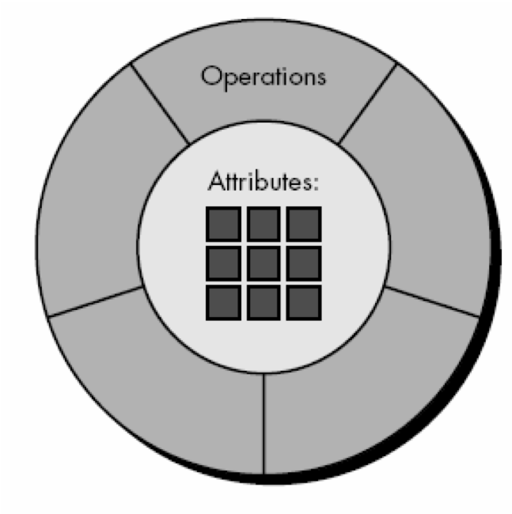
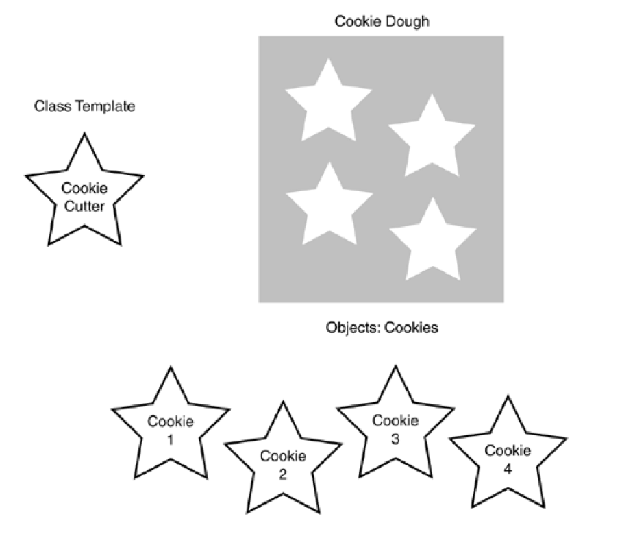

# Orientação a Objetos

## Conceitos básicos de orientação a objetos

* Objeto - a melhor forma de compreender o que são os objetos é associar com uma abstração do mundo real. No mundo real, os objetos possuem características e comportamentos. Por exemplo, um carro possui características como cor, tamanho, peso, etc. e comportamentos como ligar, andar para frente e para trás.  Em um sistema, as características são chamados de **atributos** ("variáveis") e os comportamentos, que conferem uma ação para os objetos, são chamado de **métodos** ("funções/procedimentos"). A figura abaixo ilustra um objeto:

<center>
<br/>
Figura 1 - Objeto
</center>

* Classes - Definem o formato de um objeto (molde ou template) e são utilizadas para instânciar (criar) os objetos

<center>
<br/>
Figura 2 - Classe
</center>

* Encapsulamento - Encapsulamento consiste em isolar aspectos internos de um objeto. Observe que na Figura 1, não conseguimos acesso direto aos atributos, ou seja, necessitamos passar/executar um método para obter o valor de um atributo. O encapsulamento é um conceito fundamental pois diminui a quantidade de variáveis globais em um sistema.

## Orientação a objetos em JavaScript: ECMAScript 2015

Primeiro, observe o diagrama de classes abaixo:
<center>

</center>

Para implementar o [diagrama](http://www.plantuml.com/plantuml/proxy?cache=no&src=https://raw.githubusercontent.com/rodrigoprestesmachado/cpw2/master/docs/objetos/diagrama.puml) de classes acima podemos iniciar implementando a classe, os atributos (privados) e o construtor da seguinte maneira:

```javascript
class User {
    // Atributos privados (#)
    #id;
    #name;

    // Construtor
    constructor(id, name) {
      this.#id = id;
      this.#name = name;
    }
  }
  ```

---
**Nota:** A síntaxe (#) para definir atributos privados ainda é nova no JavaScript. Por essa razão, ferramentas de análise estática de código como o [Jslint](https://www.jslint.com) podem ainda não estar adaptadas para essa nova forma de escrita de código e reclamarem sobre o seu uso.

---

Como os atributos são privados, devido a presença do sustenido (#), então o próximo passo é criar os métodos `get` e `set` para cada atributo:

  ```javascript
  class User {
    // Atributos privados (símbolo - #)
    #id;
    #name;

    // Construtor
    constructor(id, name) {
      this.#id = id;
      this.#name = name;
    }

    // Get and Set
    getId(){
        return this.#id;
    }

    setId(id){
        this.#id = id;
    }

    getName(){
        return this.#name;
    }

    setName(name){
        this.#name = name;
    }
  }
  ```

O próximo passo é implementar a classe `Message`da seguinte maneira:

```javascript
class Message {

    // Atributos privados
    #id;
    #text;

    // Construtor
    constructor(id, text) {
        this.#id = id;
        this.#text = text;
      }

    // Get and set
    getId(){
        return this.#id;
    }

    setId(id){
        this.#id = id;
    }

    getText(){
        return this.#text;
    }

    setText(text){
        this.#text = text;
    }
  }

```

Existe um relacionamento entre as classes `User` e `Message` indicando que, um usuário pode escrever uma ou mais mensagens e a mensagem pode ser apenas de um usuário. Note que o diagrama mostra uma seta de `User` para `Message`, ou seja, deve ser implementado apenas o relacionamento da classe `User` para `Message` e não vice-versa. Assim, a classe `User` deve ser modificada da seguinte forma:

```javascript
class User {
    // Atributos privados (#)
    #id;
    #name;
    #messages;

    // Construtor
    constructor(id, name) {
      this.#id = id;
      this.#name = name;
      this.#messages = [];
    }

    // Get and Set
    getId(){
        return this.#id;
    }

    setId(id){
        this.#id = id;
    }

    getName(){
        return this.#name;
    }

    setName(name){
        this.#name = name;
    }

    getMessages(){
        return this.#messages;
    }

    setMessage(message){
        this.#messages.push(message);
    }
  }
  ```

Como um usuário pode escrever muitas mensagens, então note que o atributo `#messages` deve ser implementado no construtor como um `Array`. Observe também que o método `setMessage` irá receber um objeto da classe `Message` que, posteriormente, será adicionado no array de objetos mensagens.

Para criar objetos dessas duas classes podemos criar terceiro arquivo `index.js` por exemplo:

```javascript
//https://developer.mozilla.org/pt-BR/docs/Web/JavaScript/Reference/Strict_mode
"use strict";

// Importando as duas classes
import {User} from "./src/User.js"
import {Message} from "./src/Message.js"

// Instanciando os objetos
let user = new User(1, "Rodrigo");
let message = new Message(1, "minha primeira mensagem");
// associando uma mensagem ao usuário Rodrigo
user.setMessage(message);

// Mostrando no console
console.log(user.getId());
console.log(user.getMessages()[0].getText());
```

Se tentarmos executar o `index.js` com o [Node](https://nodejs.org/en/) (`node index.js`), receberemos um erro parecido com esse:

```shell
node index.js
index.js:5
import {User} from "./User.js"
        ^^^^
SyntaxError: The requested module './User.js' does not provide an export named 'User'
```

Isso aconteceu pois devemos exportar as classes/tipos `User` e também `Message` adicionando a palavra chave `export` no início das classes:

```javascript
export class User {
  //code
}
```

```javascript
export class Message {
  //code
}
```

Quando utilizamos a diretiva `export` no fundo estamos criando um [Módulo em JavaScript](https://developer.mozilla.org/pt-BR/docs/Web/JavaScript/Guide/Modules). Neste sentido, temos que declarar para o [Node](https://nodejs.org/en/) que estamos trabalhando com um módulo criando um arquivo chamado `package.json` com o seguinte conteúdo:

```json
{
    "type": "module"
}
```

Finalmente, podemos agora executar os nossos objetos escritos no arquivo `index.js` da seguinte maneira:

```shell
node index.js
```

Da mesma forma, agora podemos executar o nosso `index.js` dentro de uma página HTML, mas, temos que indicar que estamos trabalhando com um módulo `<script src="index.js" type="module"></script>`, veja o exemplo:

```html
<!DOCTYPE html>
<html lang="en">
<head>
    <meta charset="UTF-8">
    <meta http-equiv="X-UA-Compatible" content="IE=edge">
    <meta name="viewport" content="width=device-width, initial-scale=1.0">
    <title>JS</title>
</head>
<body>
    Por favor, olhe o console do navegador
    <script src="index.js" type="module"></script>
</body>
</html>
```

## Herança 

Herança é um princípio de orientação a objetos, que permite que classes compartilhem atributos e métodos com a intenção de reaproveitar trechos de código.

Observe agora uma modificação no diagrama de classes anterior:
<center>

</center>

Note que no [diagrama](http://www.plantuml.com/plantuml/proxy?cache=no&src=https://raw.githubusercontent.com/rodrigoprestesmachado/cpw2/master/docs/objetos/heranca.puml) acima foi adicionado duas novas classe chamadas `TextMessage` e `VoiceMessage` que herdam trechos de código da classe `Message`. Nesse caso, dizemos que `TextMessage` e `VoiceMessage` são especializações (ou sub classes) da classe `Message`, pois, possuem atributos/códigos específicos sobre mensagem no formado de texto e áudio. Por sua vez, dizemos que a classe `Message` é uma generalização (ou super classe) das classes `TextMessage` e `VoiceMessage`, pois possuem trechos de código que são comuns a essas duas sub classes. Para se implementar, por exemplo, uma herança entre na classe `TextMessage` utilizamos a palavra chave `extends`, veja a implementação das classes `Message` e `TextMessage`:

```javascript 
export class Message {

    // Atributos privados
    #id;

    // Construtor
    constructor(id) {
        this.#id = id;
    }

    // Get and Set
    getId() {
        return this.#id;
    }

    setId(id) {
        this.#id = id;
    }
}
```

```javascript
import { Message } from "./Message.js";

export class TextMessage extends Message {

    // Atributos privados
    #text;

    // Construtor
    constructor(id, text) {
        super(id);
        this.#text = text;
    }

    getText() {
        return this.#text;
    }

    setText(text) {
        this.#text = text;
    }

}
```

Observe que `TextMessage` está herdando código da classe `Message` por meio do `extends`. Assim, a classe `TextMessage` possui, por exemplo, todo o código relacionado com o atributo `#id` que foi implementado na super classe `Message`. Outro ponto que vale ressaltar é o a palavra `super` onde, nesse caso, está realizando uma chamada para o construtor da super classe (`Message`) a fim de realizar a inicialização do atributo `#id`. A chamada de um construtor da super classe possui uma única regra, ser a primeira linha de código a ser escrita no construtor da subclasse (`TextMessage`). Finalmente, veja a alteração que foi realizada no arquivo `index.js`:

```javascript
//https://developer.mozilla.org/pt-BR/docs/Web/JavaScript/Reference/Strict_mode
"use strict";

// Importando as duas classes
import { User } from "./src/User.js"
import { TextMessage } from "./src/TextMessage.js";

// Instanciando os objetos
let user = new User(1, "Rodrigo");
let textMessage = new TextMessage(1, "mensagem de texto");
// associando uma mensagem ao usuário Rodrigo
user.setMessage(textMessage);

// Mostrando no console
console.log(user.getId());
console.log(user.getMessages()[0].getText());
```

Os trechos de códigos desse exemplo pode ser obtido e analisados neste [repositório](https://github.com/rodrigoprestesmachado/cpw2/tree/master/docs/objetos/exemplo).
## Babel

O [Babel](https://babeljs.io) é um conjunto de ferramentas usado para converter o código ECMAScript 2015 (ou superior) em uma versão compatível com versões anteriores de JavaScript. O Babel é capaz de realizar uma transformação da sintaxe do JavaScript e preencher os recursos que estão faltando em seu ambiente de destino (Polyfill), como por exemplo:

```javascript
// Babel Input: ES2015 arrow function
[1, 2, 3].map(n => n + 1);

// Babel Output: ES5 equivalent
[1, 2, 3].map(function(n) {
  return n + 1;
});
```

Nesse sentido, podemos utilizar a sintaxe atual do JavaScript e fazer com o que o Babel traduza o nosso código para sintaxe mais antigas.

## JavaScript Object Notation - JSON

* JavaScript Object Notation ([JSON](https://www.json.org)) é uma notação que nos permite escrever objetos em JavaScript muito utilizada para troca de dados entre sistemas, um exemplo de objetos JavaScript escrito na notação JSON pode ser:

```json
{"estudantes ":[
     { "nome": "João", "notas": [ 8, 9, 5 ] },
     { "nome": "Maria", "notas": [ 8, 10, 7 ] },
]}
```

No exemplo acima temos um objeto JavaScript que possui um atributo chamado `estudantes` que, por sua vez, possui um array contendo dois objetos. Note que o parênteses `{}` definem o objeto, os colchetes `[]` definem um array (que podem ser de objetos ou não) e os dois pontos `:` separa o atributo do seu valor.

## Referências

[MDN: Classes](https://developer.mozilla.org/pt-BR/docs/Web/JavaScript/Reference/Classes)

[MDN: Membros privados](https://developer.mozilla.org/en-US/docs/Web/JavaScript/Reference/Classes/Private_class_fields)
