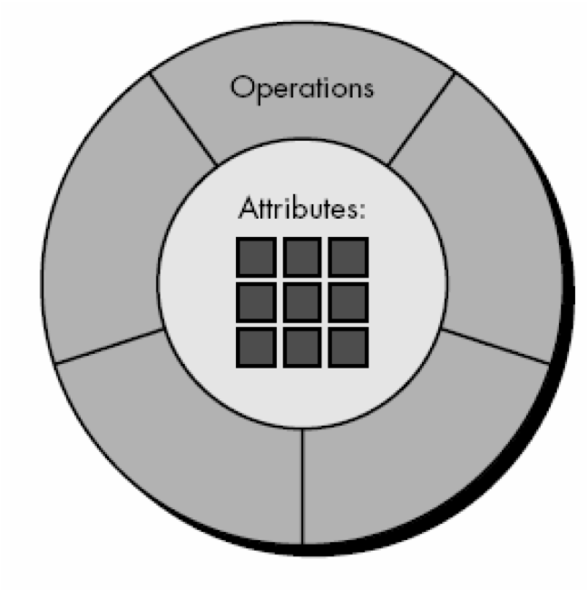
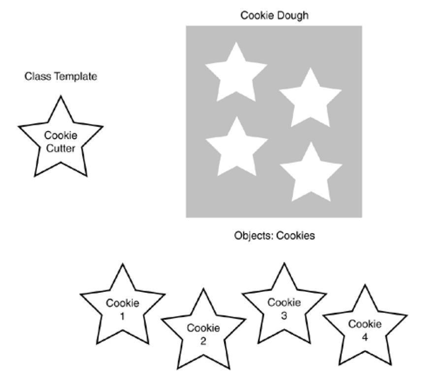

# Orientação a Objetos

## Conceitos básicos de orientação a objetos

A melhor forma de compreender o que são os objetos é associar com uma
abstração do mundo real. No mundo real, os objetos possuem características e
comportamentos. Por exemplo, um carro possui características como cor, tamanho
e peso, além de comportamentos como ligar e andar para frente ou para trás. Em
um sistema, as características são chamadas de **atributos** ("variáveis") e
os comportamentos, que conferem uma ação aos objetos, são chamados de
**métodos** ("funções/procedimentos"). A figura abaixo ilustra um objeto:
{: .fs-3 }

<center>
<br/>
Figura 1 - Objeto
</center>

Em outras palavras, o conjunto de atributos de um objeto em um determinado
momento é chamado de **estado** do objeto, e o conjunto de ações que ele pode
executar é chamado de **comportamento**. Essa dupla, estado e comportamento, é
a base de qualquer objeto em um sistema orientado a objetos.
{: .fs-3 }

Classes definem o formato de um objeto (molde ou template) e são utilizadas
para instanciar (criar) os objetos.
{: .fs-3 }

<center>
<br/>
Figura 2 - Classe
</center>

Encapsulamento consiste em isolar aspectos internos de um objeto. Observe que
na Figura 1 não conseguimos acesso direto aos atributos, ou seja, necessitamos
passar por um método para obter o valor de um atributo. O encapsulamento é um
conceito fundamental, pois diminui a quantidade de variáveis globais em um
sistema e protege o estado interno do objeto contra alterações indevidas.
{: .fs-3 }

## Orientação a objetos em JavaScript: ECMAScript 2015

Para tornar esses conceitos mais concretos, vamos construir, ao longo desta
seção, um pequeno sistema de mensagens formado por duas classes: `User`
(usuário) e `Message` (mensagem). Esse mesmo exemplo será reutilizado mais
adiante para explicar herança e JSON, de modo que toda a página segue um único
fio condutor.
{: .fs-3 }

Primeiro, observe o diagrama de classes abaixo:
<center>

</center>

O [diagrama](http://www.plantuml.com/plantuml/proxy?cache=no&src=https://raw.githubusercontent.com/rodrigoprestesmachado/cpw2/master/docs/objetos/diagrama.puml)
acima segue a notação UML (Unified Modeling Language), amplamente utilizada
para representar classes de forma visual antes de escrevê-las em código. Cada
classe é desenhada como um retângulo dividido em três partes: o nome da
classe, seus atributos e seus métodos. O sinal `-` antes de um atributo indica
que ele é privado (só pode ser acessado de dentro da própria classe), enquanto
o sinal `+` indicaria um atributo ou método público. É exatamente esse
atributo privado que, em JavaScript, será representado pelo símbolo `#`.
{: .fs-3 }

A seta que liga `User` a `Message`, junto com os números `1` e `*` (ou
`0..*`), representa uma associação entre as classes: cada `User` pode estar
relacionado a uma ou várias `Message`, mas cada `Message` pertence a um único
`User`. É essa relação que, mais adiante, será implementada por meio de um
atributo do tipo `Array` dentro da classe `User`.
{: .fs-3 }

Para implementar o diagrama de classes acima podemos iniciar implementando a
classe, os atributos (privados) e o construtor da seguinte maneira:
{: .fs-3 }

```javascript
class User {
    // Atributos privados (#)
    #id;
    #name;

    // Construtor
    constructor(id, name) {
      this.#id = id;
      this.#name = name;
    }
}
```
{: .fs-3 }


---
**Nota:** A sintaxe (#) para definir atributos privados ainda é nova no
JavaScript. Por essa razão, ferramentas de análise estática de código como o
[Jslint](https://www.jslint.com) podem ainda não estar adaptadas para essa nova
forma de escrita de código e reclamarem sobre o seu uso.
{: .fs-3 }

---

Como os atributos são privados, devido à presença do sustenido (#), então o
próximo passo é criar os métodos `get` e `set` para cada atributo. Esses
métodos são justamente a "porta de entrada" controlada de que falamos na
seção de encapsulamento: é por meio deles que o mundo externo consegue ler ou
alterar o estado do objeto.
{: .fs-3 }

  ```javascript
  class User {
    // Atributos privados (símbolo - #)
    #id;
    #name;

    // Construtor
    constructor(id, name) {
      this.#id = id;
      this.#name = name;
    }

    // Get and Set
    getId(){
        return this.#id;
    }

    setId(id){
        this.#id = id;
    }

    getName(){
        return this.#name;
    }

    setName(name){
        this.#name = name;
    }
  }
```
{: .fs-3 }

O próximo passo é implementar a classe `Message` da mesma maneira:
{: .fs-3 }

```javascript
class Message {

    // Atributos privados
    #id;
    #text;

    // Construtor
    constructor(id, text) {
        this.#id = id;
        this.#text = text;
      }

    // Get and set
    getId(){
        return this.#id;
    }

    setId(id){
        this.#id = id;
    }

    getText(){
        return this.#text;
    }

    setText(text){
        this.#text = text;
    }
  }
```
{: .fs-3 }

Como vimos ao analisar o diagrama, existe uma associação entre as classes
`User` e `Message`, indicando que um usuário pode escrever uma ou mais
mensagens e que cada mensagem pertence a apenas um usuário. Como a seta do
diagrama aponta de `User` para `Message`, apenas a classe `User` precisa
"conhecer" a classe `Message`, e não o contrário. Assim, a classe `User` deve
ser modificada da seguinte forma:
{: .fs-3 }

```javascript
class User {
    // Atributos privados (#)
    #id;
    #name;
    #messages;

    // Construtor
    constructor(id, name) {
      this.#id = id;
      this.#name = name;
      this.#messages = [];
    }

    // Get and Set
    getId(){
        return this.#id;
    }

    setId(id){
        this.#id = id;
    }

    getName(){
        return this.#name;
    }

    setName(name){
        this.#name = name;
    }

    getMessages(){
        return this.#messages;
    }

    setMessage(message){
        this.#messages.push(message);
    }
  }
```
{: .fs-3 }

Como um usuário pode escrever muitas mensagens, o atributo `#messages` é
implementado no construtor como um `Array`, representando fielmente a
multiplicidade `*` vista no diagrama. Observe também que o método
`setMessage` recebe um objeto da classe `Message`, que é adicionado ao array
de mensagens.
{: .fs-3 }

Para criar objetos dessas duas classes, podemos criar um terceiro arquivo
`index.js`, por exemplo:
{: .fs-3 }

```javascript
//https://developer.mozilla.org/pt-BR/docs/Web/JavaScript/Reference/Strict_mode
"use strict";

// Importando as duas classes
import {User} from "./src/User.js"
import {Message} from "./src/Message.js"

// Instanciando os objetos
let user = new User(1, "Rodrigo");
let message = new Message(1, "minha primeira mensagem");
// associando uma mensagem ao usuário Rodrigo
user.setMessage(message);

// Mostrando no console
console.log(user.getId());
console.log(user.getMessages()[0].getText());
```
{: .fs-3 }

Se tentarmos executar o `index.js` com o [Node](https://nodejs.org/en/) (`node index.js`),
receberemos um erro parecido com este:
{: .fs-3 }

```shell
node index.js
index.js:5
import {User} from "./User.js"
        ^^^^
SyntaxError: The requested module './User.js' does not provide an export named 'User'
```
{: .fs-3 }

Isso aconteceu pois devemos exportar as classes/tipos `User` e `Message`,
adicionando a palavra chave `export` no início das classes:
{: .fs-3 }

```javascript
export class User {
  //code
}
```
{: .fs-3 }

```javascript
export class Message {
  //code
}
```
{: .fs-3 }

Quando utilizamos a diretiva `export`, no fundo estamos criando um
[Módulo em JavaScript](https://developer.mozilla.org/pt-BR/docs/Web/JavaScript/Guide/Modules).
Neste sentido, temos que declarar para o [Node](https://nodejs.org/en/) que
estamos trabalhando com um módulo, criando um arquivo chamado `package.json`
com o seguinte conteúdo:
{: .fs-3 }

```json
{
    "type": "module"
}
```
{: .fs-3 }

Finalmente, podemos agora executar os nossos objetos escritos no arquivo
`index.js` da seguinte maneira:
{: .fs-3 }


```shell
node index.js
```
{: .fs-3 }


Da mesma forma, agora podemos executar o nosso `index.js` dentro de uma página
HTML, mas temos que indicar que estamos trabalhando com um módulo
(`<script src="index.js" type="module"></script>`), veja o exemplo:
{: .fs-3 }

```html
<!DOCTYPE html>
<html lang="en">
<head>
    <meta charset="UTF-8">
    <meta http-equiv="X-UA-Compatible" content="IE=edge">
    <meta name="viewport" content="width=device-width, initial-scale=1.0">
    <title>JS</title>
</head>
<body>
    Por favor, olhe o console do navegador
    <script src="index.js" type="module"></script>
</body>
</html>
```
{: .fs-3 }

## Herança

Herança é um princípio de orientação a objetos que permite que classes
compartilhem atributos e métodos, evitando a duplicação de código e
representando relações do tipo "é um" entre classes (por exemplo, uma
`TextMessage` "é uma" `Message`).
{: .fs-3 }

Observe agora uma modificação no diagrama de classes anterior:
{: .fs-3 }

<center>

</center>

Note que no [diagrama](http://www.plantuml.com/plantuml/proxy?cache=no&src=https://raw.githubusercontent.com/rodrigoprestesmachado/cpw2/master/docs/objetos/heranca.puml) acima foram
adicionadas duas novas classes, chamadas `TextMessage` e `VoiceMessage`, que
herdam trechos de código da classe `Message`. Nesse caso, dizemos que
`TextMessage` e `VoiceMessage` são especializações (ou subclasses) da classe
`Message`, pois possuem atributos/códigos específicos sobre mensagens no
formato de texto e de áudio. Por sua vez, dizemos que a classe `Message` é uma
generalização (ou superclasse) das classes `TextMessage` e `VoiceMessage`,
pois possui trechos de código que são comuns às duas subclasses. Para
implementar, por exemplo, uma herança na classe `TextMessage`, utilizamos a
palavra chave `extends`, veja a implementação das classes `Message` e
`TextMessage`:
{: .fs-3 }

```javascript
export class Message {

    // Atributos privados
    #id;

    // Construtor
    constructor(id) {
        this.#id = id;
    }

    // Get and Set
    getId() {
        return this.#id;
    }

    setId(id) {
        this.#id = id;
    }
}
```
{: .fs-3 }

```javascript
import { Message } from "./Message.js";

export class TextMessage extends Message {

    // Atributos privados
    #text;

    // Construtor
    constructor(id, text) {
        super(id);
        this.#text = text;
    }

    getText() {
        return this.#text;
    }

    setText(text) {
        this.#text = text;
    }

}
```
{: .fs-3 }

Observe que `TextMessage` está herdando código da classe `Message` por meio do
`extends`. Assim, a classe `TextMessage` possui, por exemplo, todo o código
relacionado ao atributo `#id` que foi implementado na superclasse `Message`.
Outro ponto que vale ressaltar é a palavra `super`, que, nesse caso, realiza
uma chamada ao construtor da superclasse (`Message`) a fim de inicializar o
atributo `#id`. A chamada ao construtor da superclasse possui uma única
regra: deve ser a primeira linha de código escrita no construtor da subclasse
(`TextMessage`). Finalmente, veja a alteração realizada no arquivo
`index.js`:
{: .fs-3 }

```javascript
//https://developer.mozilla.org/pt-BR/docs/Web/JavaScript/Reference/Strict_mode
"use strict";

// Importando as duas classes
import { User } from "./src/User.js"
import { TextMessage } from "./src/TextMessage.js";

// Instanciando os objetos
let user = new User(1, "Rodrigo");
let textMessage = new TextMessage(1, "mensagem de texto");
// associando uma mensagem ao usuário Rodrigo
user.setMessage(textMessage);

// Mostrando no console
console.log(user.getId());
console.log(user.getMessages()[0].getText());
```
{: .fs-3 }


Os trechos de código desse exemplo podem ser obtidos e analisados neste
[repositório](https://github.com/rodrigoprestesmachado/cpw2/tree/master/docs/objetos/exemplo).
{: .fs-3 }

## Babel

O [Babel](https://babeljs.io) é um conjunto de ferramentas usado para converter
o código ECMAScript 2015 (ou superior) em uma versão compatível com versões
anteriores de JavaScript. O Babel é capaz de realizar uma transformação da
sintaxe do JavaScript e preencher os recursos que estão faltando em seu
ambiente de destino (polyfill), como por exemplo:
{: .fs-3 }

```javascript
// Babel Input: ES2015 arrow function
[1, 2, 3].map(n => n + 1);

// Babel Output: ES5 equivalent
[1, 2, 3].map(function(n) {
  return n + 1;
});
```
{: .fs-3 }


Nesse sentido, podemos utilizar a sintaxe atual do JavaScript e fazer com que
o Babel traduza o nosso código para uma sintaxe mais antiga.
{: .fs-3 }

## JSON (_JavaScript Object Notation_)

JSON (_JavaScript Object Notation_) é um formato de dados textual, leve e
fácil de ler, amplamente utilizado para troca de dados entre sistemas. Sua
sintaxe é inspirada na sintaxe de objetos JavaScript, mas é importante
entender que JSON não é um objeto JavaScript: é apenas texto, seguindo regras
específicas, que pode representar dados estruturados como objetos e arrays.
Um valor em JSON só pode ser uma string, um número, um booleano, `null`, um
objeto ou um array; funções e o valor `undefined`, por exemplo, não existem em
JSON.
{: .fs-3 }

Para consolidar essa ideia, vamos retomar o exemplo de `User` e `Message`
construído nas seções anteriores e usá-lo para explicar, na prática, como
converter objetos em JSON e vice-versa.
{: .fs-3 }

### Convertendo um objeto simples com `JSON.stringify`

Antes de trabalhar com as classes `User` e `Message`, vamos ver a conversão
mais simples possível: a de um objeto literal. O método `JSON.stringify()`
recebe um objeto JavaScript e devolve uma string no formato JSON:
{: .fs-3 }

```javascript
let message = {
  id: 1,
  text: "minha primeira mensagem"
};

let json = JSON.stringify(message);
console.log(json); // '{"id":1,"text":"minha primeira mensagem"}'
```
{: .fs-3 }

Já o caminho inverso, transformar uma string JSON em um objeto JavaScript, é
feito com `JSON.parse()`:
{: .fs-3 }

```javascript
let texto = '{"id":1,"text":"minha primeira mensagem"}';
let objeto = JSON.parse(texto);
console.log(objeto.text); // minha primeira mensagem
```
{: .fs-3 }

### O problema de serializar objetos com atributos privados

Agora vamos tentar aplicar `JSON.stringify()` diretamente em uma instância da
classe `User` construída anteriormente:
{: .fs-3 }

```javascript
let user = new User(1, "Rodrigo");
console.log(JSON.stringify(user)); // "{}"
```
{: .fs-3 }

O resultado é surpreendente: um objeto vazio. Isso acontece porque
`JSON.stringify()` só consegue enxergar propriedades públicas e enumeráveis
do objeto, e os atributos `#id` e `#name` são privados, exatamente o
comportamento de encapsulamento descrito no início desta página. O
encapsulamento, que protege o estado do objeto contra acessos indevidos,
também impede que a serialização automática enxergue esse estado.
{: .fs-3 }

### Controlando a serialização com o método `toJSON`

Para resolver esse problema, podemos implementar um método especial chamado
`toJSON()` dentro da classe. Quando esse método existe, `JSON.stringify()`
chama-o automaticamente e serializa o objeto simples retornado por ele, em vez
de tentar acessar diretamente as propriedades da instância:
{: .fs-3 }

```javascript
export class User {
    // Atributos privados (#)
    #id;
    #name;
    #messages;

    // Construtor
    constructor(id, name) {
      this.#id = id;
      this.#name = name;
      this.#messages = [];
    }

    // Get and Set
    getId(){ return this.#id; }
    setId(id){ this.#id = id; }
    getName(){ return this.#name; }
    setName(name){ this.#name = name; }
    getMessages(){ return this.#messages; }
    setMessage(message){ this.#messages.push(message); }

    // Define como o objeto deve ser representado em JSON
    toJSON() {
      return {
        id: this.#id,
        name: this.#name,
        messages: this.#messages
      };
    }
}
```
{: .fs-3 }

O mesmo raciocínio se aplica à classe `Message`:
{: .fs-3 }

```javascript
export class Message {
    // Atributos privados
    #id;
    #text;

    constructor(id, text) {
        this.#id = id;
        this.#text = text;
    }

    getId(){ return this.#id; }
    setId(id){ this.#id = id; }
    getText(){ return this.#text; }
    setText(text){ this.#text = text; }

    // Define como o objeto deve ser representado em JSON
    toJSON() {
      return {
        id: this.#id,
        text: this.#text
      };
    }
}
```
{: .fs-3 }

Com o método `toJSON()` implementado, a serialização de um `User` com suas
mensagens passa a funcionar corretamente, inclusive para o array de
`Message`:
{: .fs-3 }

```javascript
let user = new User(1, "Rodrigo");
user.setMessage(new Message(1, "minha primeira mensagem"));
user.setMessage(new Message(2, "minha segunda mensagem"));

let json = JSON.stringify(user, null, 2);
console.log(json);
```
{: .fs-3 }

O trecho acima produz a seguinte saída, na qual cada `Message` do array
também foi convertida usando o seu próprio `toJSON()`:
{: .fs-3 }

```json
{
  "id": 1,
  "name": "Rodrigo",
  "messages": [
    {
      "id": 1,
      "text": "minha primeira mensagem"
    },
    {
      "id": 2,
      "text": "minha segunda mensagem"
    }
  ]
}
```
{: .fs-3 }

### Reconstruindo objetos com `JSON.parse`

O caminho inverso também merece atenção. Ao usar `JSON.parse()` sobre o texto
JSON gerado acima, o resultado é um objeto comum, e não uma instância de
`User`, o que significa que métodos como `getName()` não estarão disponíveis:
{: .fs-3 }

```javascript
let dados = JSON.parse(json);
console.log(dados.name);        // Rodrigo (propriedade comum, ok)
console.log(dados.getName());   // TypeError: dados.getName is not a function
```
{: .fs-3 }

Para reconstruir uma verdadeira instância de `User` a partir do JSON, uma
prática comum é criar um método estático `fromJSON`, responsável por ler o
objeto simples produzido por `JSON.parse()` e usá-lo para instanciar
novamente a classe:
{: .fs-3 }

```javascript
export class User {
    // ... atributos, construtor e demais métodos ...

    static fromJSON(dados) {
      let user = new User(dados.id, dados.name);
      dados.messages.forEach(m => {
        user.setMessage(new Message(m.id, m.text));
      });
      return user;
    }
}
```
{: .fs-3 }

Assim, fechamos o ciclo completo de conversão entre objetos e JSON: uma
instância de `User` pode ser transformada em texto JSON com
`JSON.stringify()`, esse texto pode ser transmitido ou armazenado, e, quando
necessário, pode ser transformado de volta em uma instância de `User` com o
auxílio de `JSON.parse()` e do método `fromJSON`.
{: .fs-3 }

## Exercícios de Fixação sobre JSON 🎯

### Teóricos

1. Explique, com suas próprias palavras, a diferença entre um objeto
   JavaScript e um documento JSON.

2. Por que `JSON.stringify(user)` retorna `"{}"` quando `user` é uma instância
   de uma classe cujos atributos são todos privados (usam o símbolo `#`)?
   Relacione sua resposta com o conceito de encapsulamento.

3. Cite três tipos de valores que são válidos em JSON e dois valores comuns em
   JavaScript que não podem ser representados diretamente em JSON.

4. Qual é a função do método `toJSON()` em uma classe JavaScript e em que
   momento ele é chamado automaticamente?

### Práticos

5. Implemente o método `toJSON()` na classe `Message` apresentada nesta
   página, caso ainda não o tenha feito, e teste-o convertendo uma única
   mensagem em JSON com `JSON.stringify()`.

6. Crie um `User`, associe a ele pelo menos três objetos `Message` e gere o
   JSON completo desse usuário usando `JSON.stringify(user, null, 2)`. Exiba o
   resultado no console.

7. Implemente o método estático `fromJSON` na classe `User`, de forma que seja
   possível executar `let user2 = User.fromJSON(JSON.parse(json))` e obter uma
   nova instância de `User` com todas as suas mensagens reconstruídas como
   instâncias de `Message`.

8. Utilizando o [Node](https://nodejs.org/en/) e o módulo `fs`, salve o JSON
   gerado no exercício 6 em um arquivo chamado `user.json` com
   `fs.writeFileSync`. Em seguida, escreva outro script que leia esse arquivo
   com `fs.readFileSync`, converta o conteúdo com `JSON.parse` e reconstrua o
   `User` usando o `fromJSON` do exercício anterior.

## Referências

[MDN: Classes](https://developer.mozilla.org/pt-BR/docs/Web/JavaScript/Reference/Classes)

[MDN: Membros privados](https://developer.mozilla.org/en-US/docs/Web/JavaScript/Reference/Classes/Private_class_fields)

[MDN: JSON.stringify()](https://developer.mozilla.org/pt-BR/docs/Web/JavaScript/Reference/Global_Objects/JSON/stringify)

[MDN: JSON.parse()](https://developer.mozilla.org/pt-BR/docs/Web/JavaScript/Reference/Global_Objects/JSON/parse)
