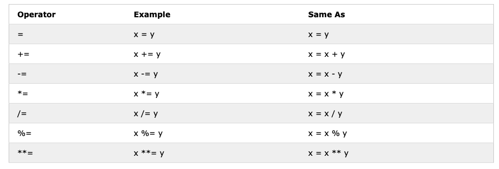
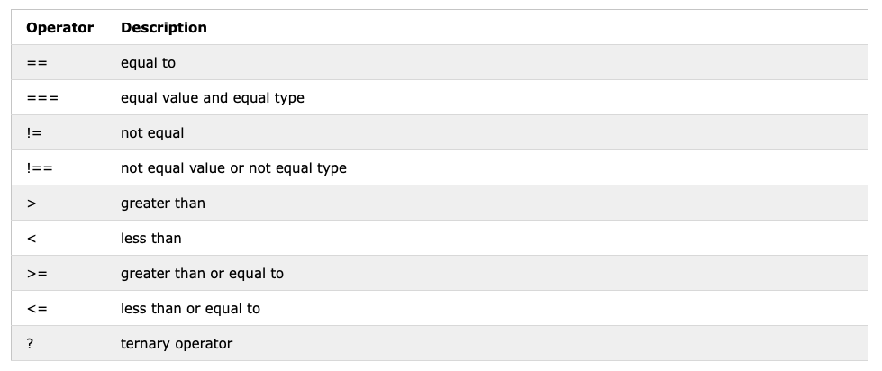
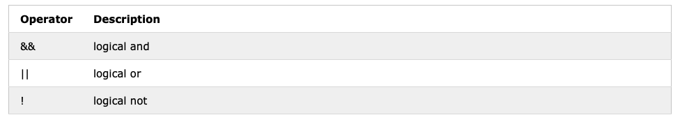

<!-- .slide:  data-background-opacity="0.3" data-background-image="imgs/title.jpg" data-transition="convex"  -->
# Operadores
<!-- .element: style="margin-bottom:100px; font-size: 50px; color:white; font-family: Marker Felt;" -->

Pressione 'F' para tela cheia
<!-- .element: style="font-size: small; color:white;" -->

[versão em pdf](?print-pdf)
<!-- .element: style="font-size: small;" -->

<!-- .slide: data-background="#4AA791" data-transition="concave"  -->
## Operadores: Aritméticos
<!-- .element: style="margin-bottom:50px; font-size: 40px; font-family: Marker Felt; color:#2B2625" -->

<a href="https://www.w3schools.com/js/js_operators.asp" target="_blank"></img></a>

<!-- .slide: data-background="#4AA791" data-transition="concave"  -->
## Operadores: Atribuição
<!-- .element: style="margin-bottom:50px; font-size: 40px; font-family: Marker Felt; color:#2B2625" -->

<a href="https://www.w3schools.com/js/js_operators.asp" target="_blank"></img></a>

<!-- .slide: data-background="#4AA791" data-transition="concave"  -->
## Operadores: Comparação
<!-- .element: style="margin-bottom:50px; font-size: 40px; font-family: Marker Felt; color:#2B2625" -->

<a href="https://www.w3schools.com/js/js_operators.asp" target="_blank"></img></a>

<!-- .slide: data-background="#4AA791" data-transition="concave"  -->
## Operadores: Lógicos
<!-- .element: style="margin-bottom:50px; font-size: 40px; font-family: Marker Felt; color:#2B2625" -->

<a href="https://www.w3schools.com/js/js_operators.asp" target="_blank"></img></a>

<!-- .slide: data-background="#4AA791" data-transition="concave"  -->
## Operadores: Tipo
<!-- .element: style="margin-bottom:50px; font-size: 40px; font-family: Marker Felt; color:#2B2625" -->

<a href="https://www.w3schools.com/js/js_operators.asp" target="_blank"></img></a>

<!-- .slide: data-background="#4AA791" data-transition="concave"  -->
## Operadores: Bitwise
<!-- .element: style="margin-bottom:50px; font-size: 40px; font-family: Marker Felt; color:#2B2625" -->

<a href="https://www.w3schools.com/js/js_operators.asp" target="_blank"></img></a>

<!-- .slide:  data-background-opacity="0.1" data-background-image="https://miro.medium.com/max/1800/1*6ahbWjp_g9hqhaTDSJOL1Q.png" data-transition="convex"  -->
# Referências 📚
<!-- .element: style="margin-bottom:50px; font-size: 40px; font-family: Marker Felt; color:#F5F5F5" -->

* MDN [JavaScript basics](https://developer.mozilla.org/en-US/docs/Learn/Getting_started_with_the_web/JavaScript_basics)
<!-- .element: style="margin-bottom:60px; font-size: 25px; font-family: arial; color:#F5F5F5" -->

* Tutorial de [JavaScript](http://www.w3schools.com/js) do W3C
<!-- .element: style="margin-bottom:60px; font-size: 25px; font-family: arial; color:#F5F5F5" -->

* MILETTO, Evandro Manara. [Desenvolvimento de software II: introdução ao desenvolvimento web com html, css, javascript e php](https://biblioteca.ifrs.edu.br/pergamum_ifrs/biblioteca_s/acesso_login.php?cod_acervo_acessibilidade=5020682&acesso=aHR0cHM6Ly9pbnRlZ3JhZGEubWluaGFiaWJsaW90ZWNhLmNvbS5ici9ib29rcy85Nzg4NTgyNjAxOTY5&label=acesso%20restrito). Porto Alegre Bookman 2014 1 recurso online ISBN 9788582601969.
<!-- .element: style="margin-bottom:60px; font-size: 25px; font-family: arial; color:#F5F5F5" -->

 
<a rel="license" href="http://creativecommons.org/licenses/by/4.0/">CC BY 4.0 DEED</a>

