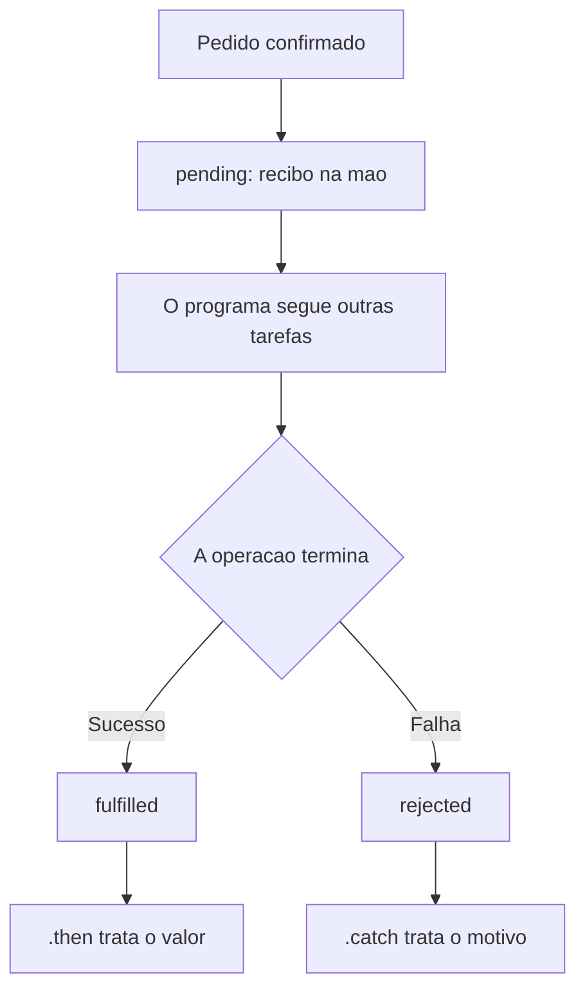

# Promise

<center>
<iframe src="https://cpw2.rpmhub.dev/promise/slides/index.html#/" title="Promise" width="90%" height="500" style="border:none;"></iframe>
</center>

Uma Promise (promessa) em JavaScript é um objeto que representa o resultado
futuro de uma operação assíncrona. No momento em que ela é criada, esse
resultado ainda pode não existir. A Promise guarda o lugar desse valor e avisa
o programa quando ele ficar disponível, ou quando a operação falhar.
{: .fs-3 }

**Uma analogia:** imagine que você compra um livro em uma loja online. Assim
que confirma o pedido, a loja entrega um **recibo**. O livro ainda não está na
sua mão: o recibo é a garantia de que a encomenda está a caminho. Mais tarde,
duas coisas podem acontecer. O pacote chega e você abre a caixa, ou a loja
cancela o pedido e você precisa reagir a isso (pedir reembolso, comprar em
outro lugar). Enquanto espera, você não fica parado na porta: continua
estudando, respondendo mensagens, fazendo outras tarefas.
{: .fs-3 }

A Promise é esse recibo. Ela nasce na hora em que a operação começa. O valor
(o "livro") chega depois. O restante do programa segue em frente e só trata o
resultado quando a Promise muda de estado.
{: .fs-3 }

Antes das Promises, o JavaScript encadeava essas esperas com funções de
callback passadas umas dentro das outras. Com várias etapas, o código ficava
aninhado e difícil de ler. A Promise organiza essa espera em estados e em uma
sequência de tratamentos.
{: .fs-3 }

## Os três estados

Uma Promise está sempre em um destes estados:

* **pending** (pendente): estado inicial. A encomenda foi registrada, mas o
  pacote ainda não chegou e o pedido ainda não foi cancelado.
* **fulfilled** (cumprida): a operação terminou com sucesso. O pacote foi
  entregue e a Promise carrega o valor produzido.
* **rejected** (rejeitada): a operação falhou. O pedido foi cancelado e a
  Promise carrega o motivo da falha.
{: .fs-3 }

Quando a Promise sai de `pending`, ela se estabelece: passa para `fulfilled`
ou para `rejected` e não volta atrás. Um pacote entregue não volta a estar
"a caminho".
{: .fs-3 }

As funções `resolve` e `reject` são o que a operação usa para concluir a
Promise. Chamar `resolve(valor)` leva a Promise ao estado `fulfilled` e entrega
o valor. Chamar `reject(motivo)` leva a Promise ao estado `rejected` e entrega
o motivo da falha. O estado de sucesso tem o nome `fulfilled`. Em muitos textos
e mensagens de erro aparece a palavra *resolved* como forma informal de dizer
que a Promise já se estabeleceu com sucesso.
{: .fs-3 }


{: .fs-3 }

## Criando uma Promise

Ao criar uma Promise com `new Promise`, você passa uma função executora. O
JavaScript chama essa função na hora e entrega dois parâmetros: `resolve` e
`reject`. Dentro dela fica o trabalho que pode demorar. No exemplo abaixo, o
`setTimeout` simula os quatro segundos que a transportadora leva para concluir
a entrega.
{: .fs-3 }

```javascript
let entrega = new Promise((resolve, reject) => {
  setTimeout(() => {
    let estoqueDisponivel = true;

    if (estoqueDisponivel) {
      resolve("Livro entregue: JavaScript Guia Definitivo");
    } else {
      reject("Pedido cancelado: livro sem estoque");
    }
  }, 4000);
});
```
{: .fs-3 }

Trocar `estoqueDisponivel` para `false` simula a loja cancelando o pedido. A
Promise é criada na mesma hora, em estado `pending`. Só quatro segundos depois
ela é cumprida ou rejeitada.
{: .fs-3 }

## Quando o pacote chega: `.then()` e `.catch()`

O método `.then()` registra o que fazer quando a Promise é cumprida: abrir a
caixa e usar o valor. O método `.catch()` registra o que fazer quando ela é
rejeitada: ler o motivo e reagir à falha.
{: .fs-3 }

```javascript
entrega
  .then((pacote) => {
    console.log(pacote);
  })
  .catch((motivo) => {
    console.error(motivo);
  });
```
{: .fs-3 }

Com `estoqueDisponivel` igual a `true`, o console mostra a mensagem de entrega.
Com `false`, o `.catch()` recebe `"Pedido cancelado: livro sem estoque"`. O
código depois de `entrega.then(...)` não fica parado nesses quatro segundos: o
navegador continua livre para desenhar a página e responder ao usuário.
{: .fs-3 }

## Encadeamento

Uma encomenda real tem etapas. O pagamento é confirmado, o pacote é separado no
estoque e só então a transportadora faz a entrega. Cada etapa depende do
resultado da anterior.
{: .fs-3 }

O encadeamento faz isso com vários `.then()`. O valor devolvido por um `.then()`
vira a entrada do próximo. Se esse retorno for outra Promise, o próximo
`.then()` espera essa nova Promise terminar.
{: .fs-3 }

```javascript
function confirmarPagamento() {
  return new Promise((resolve) => {
    setTimeout(() => resolve("Pagamento confirmado"), 1000);
  });
}

function separarPacote(etapaAnterior) {
  return new Promise((resolve) => {
    setTimeout(() => resolve(etapaAnterior + " → pacote separado"), 1000);
  });
}

function enviar(etapaAnterior) {
  return new Promise((resolve) => {
    setTimeout(() => resolve(etapaAnterior + " → pedido a caminho"), 1000);
  });
}

confirmarPagamento()
  .then((resultado) => separarPacote(resultado))
  .then((resultado) => enviar(resultado))
  .then((resultado) => {
    console.log(resultado);
  })
  .catch((motivo) => {
    console.error(motivo);
  });
```
{: .fs-3 }

Um único `.catch()` no final trata a falha de qualquer etapa da cadeia. Se o
pagamento falhar, as etapas seguintes não rodam, do mesmo modo que a loja não
separa um pacote de um pedido que não foi pago.
{: .fs-3 }

## Async/Await

O ECMAScript 2017 introduziu `async` e `await` para escrever essa mesma espera
em uma sequência linear, parecida com código que executa passo a passo.
{: .fs-3 }

Uma função marcada com `async` devolve uma Promise. Dentro dela, `await`
pausa só aquela função até a Promise ser cumprida e entrega o valor direto
numa variável. O restante da página continua rodando.
{: .fs-3 }

```javascript
async function acompanharEntrega() {
  try {
    let pagamento = await confirmarPagamento();
    let pacote = await separarPacote(pagamento);
    let envio = await enviar(pacote);
    console.log(envio);
  } catch (motivo) {
    console.error(motivo);
  }
}

acompanharEntrega();
```
{: .fs-3 }

`await` só pode aparecer dentro de uma função `async`. O `try`/`catch` ocupa o
lugar do `.catch()`: se alguma das Promises for rejeitada, a execução salta
para o `catch` com o motivo da falha.
{: .fs-3 }

## O fetch por dentro: XMLHttpRequest e Promise

O `fetch()` do navegador já devolve uma Promise. Pedir dados a um servidor é a
mesma espera da encomenda: a requisição sai na hora, a resposta chega depois, e
`.then()` (ou `await`) trata o que veio.
{: .fs-3 }

Por baixo, o navegador continua usando o `XMLHttpRequest` que você já viu em
Ajax. Dá para escrever uma versão mínima do `fetch` e ver a Promise nascer em
volta dessa requisição. A função abaixo devolve o recibo na hora. O
`XMLHttpRequest` faz o trabalho e, quando a resposta chega, chama `resolve` ou
`reject`.
{: .fs-3 }

```javascript
function buscar(url) {
  return new Promise((resolve, reject) => {
    let xhr = new XMLHttpRequest();
    xhr.open("GET", url, true);

    xhr.onreadystatechange = () => {
      if (xhr.readyState === 4) {
        if (xhr.status >= 200 && xhr.status < 300) {
          resolve(xhr.responseText);
        } else {
          reject(new Error("Erro HTTP: " + xhr.status));
        }
      }
    };

    xhr.onerror = () => {
      reject(new Error("Falha de rede"));
    };

    xhr.send();
  });
}

buscar("pedido.json")
  .then((texto) => {
    let pedido = JSON.parse(texto);
    console.log(pedido.produto);
  })
  .catch((motivo) => {
    console.error(motivo);
  });
```
{: .fs-3 }

A chamada `buscar("pedido.json")` devolve a Promise ainda pendente, e o
`xhr.send()` dispara a requisição sem travar a página. Quando `readyState`
chega a 4, a operação terminou. Um status entre 200 e 299 cumpre a Promise com
o texto da resposta. Qualquer outro status, ou uma falha de rede, rejeita a
Promise e cai no `.catch()`.
{: .fs-3 }

O `fetch` do navegador faz esse embrulho para você e cumpre a Promise com um
objeto `Response`, em vez do texto cru. `response.json()` lê esse corpo e
devolve outra Promise, já convertida em objeto. Por isso uma busca com `fetch`
costuma ter dois `.then()`: o primeiro confirma a resposta e devolve o JSON; o
segundo usa o objeto.
{: .fs-3 }

```javascript
fetch("pedido.json")
  .then((response) => {
    if (!response.ok) {
      throw new Error("Erro HTTP: " + response.status);
    }
    return response.json();
  })
  .then((pedido) => {
    console.log(pedido.produto);
  })
  .catch((motivo) => {
    console.error(motivo);
  });
```
{: .fs-3 }

No `fetch`, um status 404 ou 500 ainda cumpre a Promise. O objeto `Response`
chega no primeiro `.then()` com `response.ok` valendo `false`. A verificação
do status fica ali: o `throw` desvia a cadeia para o `.catch()`, do mesmo modo
que o `reject` faz na função `buscar`.
{: .fs-3 }

Neste diretório de exemplos há um Ajax escrito com Promise e versões menores
com Promise e com `async`/`await`.
{: .fs-3 }

```sh
git clone -b dev https://github.com/rodrigoprestesmachado/cpw2
cd cpw2/exemplos/ajax-promise
code .
```

## Exercícios do freeCodeCamp

* [Create a JavaScript Promise](https://www.freecodecamp.org/learn/javascript-algorithms-and-data-structures/es6/create-a-javascript-promise)

* [Complete a Promise with resolve and reject](https://www.freecodecamp.org/learn/javascript-algorithms-and-data-structures/es6/complete-a-promise-with-resolve-and-reject)

* [Handle a Fulfilled Promise with then](https://www.freecodecamp.org/learn/javascript-algorithms-and-data-structures/es6/handle-a-fulfilled-promise-with-then)

* [Use Arrow Functions to Write Concise Anonymous Functions](https://www.freecodecamp.org/learn/javascript-algorithms-and-data-structures/es6/use-arrow-functions-to-write-concise-anonymous-functions)

## Exercícios de Fixação Práticos

Os exercícios abaixo são progressivos. Cada um acrescenta uma peça em cima do
anterior. Crie uma página HTML simples, coloque o script antes do
`</body>` e acompanhe o resultado no console do navegador (ou em um elemento
da página, quando o enunciado pedir).
{: .fs-3 }

1. **O recibo da entrega**

    Crie uma Promise que, depois de 2 segundos, chame `resolve` com a mensagem
    `"Encomenda entregue"`. Use `.then()` para mostrar essa mensagem no
    console. Abra a página e confira que a mensagem só aparece depois da
    espera.

2. **Pedido cancelado**

    Acrescente um caminho de falha à Promise do exercício 1. Use uma variável
    `estoqueDisponivel`. Quando ela for `true`, resolva com a mensagem de
    entrega. Quando for `false`, rejeite com `"Pedido cancelado: sem estoque"`.
    Trate a falha com `.catch()` e mostre o motivo no console. Teste os dois
    valores da variável.

3. **Duas etapas da encomenda**

    Escreva duas funções, cada uma devolvendo uma Promise que resolve depois de
    cerca de 1 segundo:

    * `confirmarPagamento()` resolve com `"Pagamento confirmado"`.
    * `separarPacote(etapaAnterior)` resolve com o texto da etapa anterior
      seguido de `" → pacote separado"`.

    Encadeie as duas com `.then()`. No último `.then()`, mostre o texto final
    no console. Inclua um `.catch()` no fim da cadeia.

4. **A mesma encomenda com `async`/`await`**

    Reescreva o exercício 3 dentro de uma função `async`. Use `await` em cada
    etapa e `try`/`catch` para o caso de falha. O texto exibido no console deve
    ser o mesmo do exercício anterior.

5. **Uma função, dois destinos**

    Escreva uma função `consultarPedido(numero)` que devolve uma Promise. Se
    `numero` for maior que zero, resolva com `"Pedido " + numero + " encontrado"`.
    Caso contrário, rejeite com `"Número de pedido inválido"`. Chame a função
    duas vezes, uma com um número válido e outra com `0`, e trate sucesso e
    falha em cada chamada. As duas chamadas podem usar `.then()`/`.catch()` ou
    `async`/`await`.

6. **Buscar um JSON com `fetch()`**

    Crie um arquivo `pedido.json` na mesma pasta da página, por exemplo
    `{ "produto": "Caderno", "status": "a caminho" }`. Use `fetch("pedido.json")`.
    A função `fetch` devolve uma Promise: no primeiro `.then()`, converta a
    resposta com `response.json()` e devolva essa nova Promise. No `.then()`
    seguinte, mostre apenas o `produto` dentro de um `<p id="resultado">`.
    Trate falha de rede com `.catch()`. Sirva a pasta com um servidor local
    para o `fetch` conseguir ler o arquivo.

7. **Um `fetch` mínimo com `XMLHttpRequest`**

    Escreva uma função `buscar(url)` que devolva uma Promise. Dentro dela, use
    `XMLHttpRequest` para fazer um GET assíncrono a essa URL. Quando
    `readyState` for 4 e o `status` estiver entre 200 e 299, chame `resolve`
    com `xhr.responseText`. Se o status estiver fora dessa faixa, ou se ocorrer
    um erro de rede (`xhr.onerror`), chame `reject`. Use o `pedido.json` do
    exercício anterior: no `.then()`, converta o texto com `JSON.parse` e
    mostre o `produto` dentro de `<p id="resultado">`.

## Exercício de Fixação Teórico

<center>
    <iframe src="https://cpw2.rpmhub.dev/promise/slides/questions.html"
        title="Exercício de Fixação Teórico - Promise" width="90%" height="500"
        style="border:none;">
    </iframe>
</center>

## Referências

* [Promise](https://developer.mozilla.org/pt-BR/docs/Web/JavaScript/Reference/Global_Objects/Promise) no MDN Web Docs

* [Usando promises](https://developer.mozilla.org/pt-BR/docs/Web/JavaScript/Guide/Using_promises) no MDN Web Docs

* [Async/Await](https://javascript.info/async-await) no JavaScript.info

<center>
<a href="https://rpmhub.dev" target="blanck"></a><br/>
<a rel="license" href="http://creativecommons.org/licenses/by/4.0/">CC BY 4.0 DEED</a>
</center>
