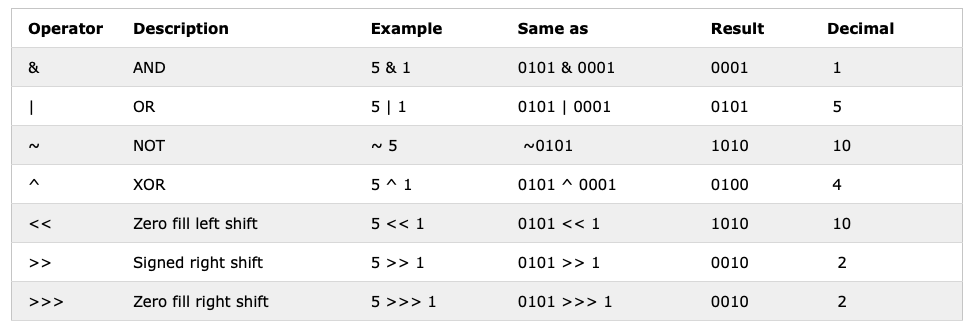

# JavaScript


rodrigo.prestes@poa.ifrs.edu.br
<!-- .element: style="margin-bottom:150px;" -->

Tela cheia? pressione a tecla 'F'
<!-- .element: style="font-size: small;" -->

Versão em PDF? [aqui](?print-pdf)
<!-- .element: style="font-size: small;" -->


<!-- .slide: data-background="#EAFFB5" data-transition="concave" -->
## Índice

* Introdução
<!-- .element: style="margin-bottom:40px; font-size: 24px;" -->
* Hello world JS
<!-- .element: style="margin-bottom:40px; font-size: 24px;" -->
* Variáveis
<!-- .element: style="margin-bottom:40px; font-size: 24px;" -->
* Tipos primitivos
<!-- .element: style="margin-bottom:40px; font-size: 24px;" -->
* Operadores
<!-- .element: style="margin-bottom:40px; font-size: 24px;" -->


## Introdução


<!-- .slide: data-background="#F1F1F1" data-transition="zoom" -->
## O que é JavaScript (JS)?

* Atualmente, JavaScript é a linguagem de programação mais popular do mundo
<!-- .element: style="margin-bottom:80px; font-size: 24px;" -->

* JavaScript é uma linguagem de programação criada inicialmente para adicionar interatividade em páginas HTML
<!-- .element: style="margin-bottom:80px; font-size: 24px;" -->

* Porém, com o [nodejs](https://nodejs.org/) atualmente também podemos rodar um código em JavaScript no lado do servidor
<!-- .element: style="margin-bottom:80px; font-size: 24px;" -->

* JavaScript é uma linguagem interpretada, ou seja, o código executa sem uma compilação prévia
<!-- .element: style="margin-bottom:80px; font-size: 24px;" -->


<!-- .slide: data-background="#F1F1F1" data-transition="zoom" -->
## O que você pode fazer com JavaScript?

* Por ser uma linguagem de programação, JavaScript permite criar conteúdo dinâmico para os usuários de páginas Web
<!-- .element: style="margin-bottom:80px; font-size: 24px;" -->

* JavaScript pode reagir a eventos em uma página Web, ou seja, pode ser executado quando alguma coisa acontecer (onclick, onblur, onfocus, etc.)
<!-- .element: style="margin-bottom:80px; font-size: 24px;" -->

* JavaScript pode ser utilizado para validar dados de formulários Web antes do envio para o servidor (*back-end*)
<!-- .element: style="margin-bottom:80px; font-size: 24px;" -->

* JavaScript é a base para o desenvolvimento de interfaces interativas na Web com AJAX(Asynchronous JavaScript And XML) e/ou Websockets
<!-- .element: style="margin-bottom:80px; font-size: 24px;" -->


<!-- .slide: data-background="#F1F1F1" data-transition="zoom" -->
## O que você pode fazer com JavaScript?

* O HTML 5 possui APIs (*Application Programming Interface*) que permitem os navegadores trabalhar com:
  * animações (2D/3D), áudio, serviço de localização, acelerômetro, vibração, entre muitas outras
<!-- .element: style="margin-bottom:80px; font-size: 24px;" -->

* Por meio do [nodejs](https://nodejs.org/), JavaScript também pode ser utilizado no lado do servidor para construir APIs  que servirão como o *back-end* de aplicações Web e/ou mobile
<!-- .element: style="margin-bottom:80px; font-size: 24px;" -->

* Aplicações para dispositivos móveis podem ser desenvolvidas com JavaScript
<!-- .element: style="margin-bottom:80px; font-size: 24px;" -->


<!-- .slide: data-background="#F1F1F1" data-transition="zoom" -->
## JS para *front-end*

* [Angular](https://angular.io) - A JavaScript library for building user interfaces
<!-- .element: style="margin-bottom:50px; font-size: 24px;" -->

* [Reactjs](https://reactjs.org) - A JavaScript library for building user interfaces
<!-- .element: style="margin-bottom:50px; font-size: 24px;" -->

* [Vue](https://vuejs.org) - The Progressive JavaScript Framework
<!-- .element: style="margin-bottom:50px; font-size: 24px;" -->


<!-- .slide: data-background="#F1F1F1" data-transition="zoom" -->
## JS para *back-end*

* [Nodejs](https://nodejs.org/en/) - A JavaScript runtime built on Chrome's V8 JavaScript engine.
<!-- .element: style="margin-bottom:50px; font-size: 24px;" -->

* [V8](https://v8.dev) - Google’s open source high-performance JavaScript and WebAssembly engine
<!-- .element: style="margin-bottom:50px; font-size: 24px;" -->

* [npm](https://www.npmjs.com) - Node package manager
<!-- .element: style="margin-bottom:50px; font-size: 24px;" -->


<!-- .slide: data-background="#F1F1F1" data-transition="zoom" -->
## JS para *mobile*

* [React Native](https://reactnative.dev) - Create native apps for Android and iOS using React
<!-- .element: style="margin-bottom:50px; font-size: 24px;" -->

* [Ionic](https://ionicframework.com) - Mobile UI toolkit for building, cross-platform native and web app
<!-- .element: style="margin-bottom:50px; font-size: 24px;" -->

* [NativeScript](https://nativescript.org) - Empower JavaScript with native APIs
<!-- .element: style="margin-bottom:50px; font-size: 24px;" -->


<!-- .slide: data-background="#F1F1F1" data-transition="zoom" -->
## Ambientes de desenvolvimento

* [Vscode](https://code.visualstudio.com) - Code editing. Redefined
<!-- .element: style="margin-bottom:50px; font-size: 24px;" -->

* [Sublime text](https://www.sublimetext.com) - A sophisticated text editor for code, markup and prose
<!-- .element: style="margin-bottom:50px; font-size: 24px;" -->

* [Webstorm](https://www.jetbrains.com/pt-br/webstorm/) - The Smartest JavaScript IDE by JetBrains
<!-- .element: style="margin-bottom:50px; font-size: 24px;" -->

* [Atom](https://atom.io) - A hackable text editor for the 21st Century
<!-- .element: style="margin-bottom:50px; font-size: 24px;" -->

* [Vim](https://www.vim.org) - The ubiquitous text editor
<!-- .element: style="margin-bottom:50px; font-size: 24px;" -->


## Hello world JS


<!-- .slide: data-transition="convex" -->
## Hello world JS

* JS dentro da *tag body*
<!-- .element: style="margin-bottom:50px; font-size: 24px;" -->

```html
<html>
    <head>
    </head>
    <body>
        <script type="text/JavaScript">
            <!--
                document.write("Hello World");
	         -->
        </script>
    </body>
</html>
```


<!-- .slide: data-transition="convex" -->
## Hello world JS

* Função JS dentro da *tag* *head*
<!-- .element: style="margin-bottom:50px; font-size: 24px;" -->

```html
<html>
    <head>
        <script type="text/JavaScript">
            function message(){
                alert("Function: Hello World");
            }
        </script>
    </head>
    <body onload="message()">
    </body>
</html>
```


<!-- .slide: data-transition="convex" -->
## Hello world JS

* Função JS dentro das *tags* *head e body*
<!-- .element: style="margin-bottom:50px; font-size: 24px;" -->

```html
<html>
    <head>
        <script type="text/JavaScript">
         function hello(){
             alert("Function: Hello World");
         }
        </script>
    </head>

	<body onload="hello()">
    	<script type="text/JavaScript">
         	<!--
         	document.write("Hello World");
         	-->
    	</script>
	</body>
</html>
```


<!-- .slide: data-transition="convex" -->
## Hello world JS

* Arquivo JS externo
<!-- .element: style="margin-bottom:50px; font-size: 24px;" -->

```html
<html>
    <head>
        <script type="text/JavaScript" src="arquivo.js">
		 </script>
    </head>

    <body>
    </body>
</html>
```

* arquivo.js

```JavaScript
function hello(){
    alert("Function: Hello World");
}
```


<!-- .slide: data-transition="convex" -->
## Hello World JS

<iframe width="100%" height="300" src="//jsfiddle.net/prestesmachado/b9ygzkqo/embedded/js,html,result/dark/" allowfullscreen="allowfullscreen" allowpaymentrequest frameborder="0"></iframe>


## Variáveis


<!-- .slide: data-background="#F1F1F1" data-transition="concave" -->
## Variáveis

* JS é uma linguagem *case-sensitive* (a e A são variáveis diferentes)
<!-- .element: style="margin-bottom:80px; font-size: 24px;" -->

* Variáveis necessitam iniciar com uma letra ou um underscore
<!-- .element: style="margin-bottom:80px; font-size: 24px;" -->

* Podemos declarar uma variável com as palavras chaves `var`, `let` e `const`
<!-- .element: style="margin-bottom:80px; font-size: 24px;" -->


<!-- .slide: data-background="#F1F1F1" data-transition="concave" -->
## var

<iframe width="100%" height="300" src="//jsfiddle.net/prestesmachado/z9egunav/28/embedded/js,html,result/" allowfullscreen="allowfullscreen" allowpaymentrequest frameborder="0"></iframe>

* Variáveis declaradas com `var` não possuem escopo de bloco `{ }`


<!-- .slide: data-background="#F1F1F1" data-transition="concave" -->
## let

* A partir do [ECMAScript 2015 - ES6](https://www.w3schools.com/js/js_es6.asp), variáveis declaradas com `let` possuem escopo de bloco `{ }`

<iframe width="100%" height="300" src="//jsfiddle.net/prestesmachado/ywbjf7gm/8/embedded/js,html,result/" allowfullscreen="allowfullscreen" allowpaymentrequest frameborder="0"></iframe>


<!-- .slide: data-background="#F1F1F1" data-transition="concave" -->
## const

* Variáveis declaradas com `const` funcionam da mesma forma daquelas declaradas com `let`, ou seja, possuem escopo de bloco

* Porém, as variáveis declaradas com `const` não podem ter seu valor alterado e necessitam receber seu valor no momento da declaração, por exemplo:

```js

const PI = 3.141592653589793;
```


## Tipo de dados primitivos


<!-- .slide: data-transition="convex" -->
## Tipo de dados primitivos

* Numbers – qualquer valor que possa ser calculado (positivo ou negativo)
<!-- .element: style="margin-bottom:50px; font-size: 24px;" -->

* String – uma sequencia de caracteres
<!-- .element: style="margin-bottom:50px; font-size: 24px;" -->

* Boolean – verdade ou falso (true e false)
<!-- .element: style="margin-bottom:50px; font-size: 24px;" -->

* Null – um valor vazio (ausência de valor)
<!-- .element: style="margin-bottom:50px; font-size: 24px;" -->

* Undefined - representa um valor indefinido
<!-- .element: style="margin-bottom:50px; font-size: 24px;" -->

* Symbol – representa um identificador escondido
<!-- .element: style="margin-bottom:50px; font-size: 24px;" -->


<!-- .slide: data-transition="convex" -->
## Numbers

* Os números podem ser escritos em três bases:
  * Base 10
    * exemplo: 56 (sem o zero)
<!-- .element: style="margin-bottom:50px; font-size: 24px;" -->
  * base 8 (octal)
    * exemplo: 056 
      * O zero na frente representa um número em octal
<!-- .element: style="margin-bottom:50px; font-size: 24px;" -->
  * base 16 (hexadecimal)
    * exemplo: ox5F ou OX5F
      * O zero x (ox) define um número em hexadecimal
<!-- .element: style="margin-bottom:50px; font-size: 24px;" -->


<!-- .slide: data-transition="convex" -->
## Numbers

* Também temos números com ponto flutuante:
  * 7.2945

  * -34.2

  * 2e3  => 2 x 103 => 2000

  * 2e-3 => 2 x 10-3 => 0.002
<!-- .element: style="margin-bottom:50px; font-size: 24px;" -->


<!-- .slide: data-transition="convex" -->
## String

* Uma string é uma sequencia de caracteres:
  * "Hello!" // String declarada com aspas duplas

  * ‘245’ // String declarada com aspas simples

  * ""  // String vazia
<!-- .element: style="margin-bottom:50px; font-size: 24px;" -->

* Nota: Uma string vazia é diferente de Null
<!-- .element: style="margin-bottom:50px; font-size: 24px;" -->


<!-- .slide: data-transition="convex" -->
## Boolean

* Diferente de outras linguagens de programação o valor de um boolean é apenas true ou false
<!-- .element: style="margin-bottom:50px; font-size: 24px;" -->

* Em JavaScript, o valor zero (0) e um (1) não são considerados como true ou false
<!-- .element: style="margin-bottom:50px; font-size: 24px;" -->


<!-- .slide: data-transition="convex" -->
## Null

* O null é um tipo de dado que indica que uma variável não possui valor
<!-- .element: style="margin-bottom:50px; font-size: 24px;" -->

* O valor null é retornado se você tentar utilizar uma variável que não foi definida e sem valor
<!-- .element: style="margin-bottom:50px; font-size: 24px;" -->

* Um exemplo, se o usuário escolher cancelar, o null é retornado na função prompt:
<!-- .element: style="margin-bottom:50px; font-size: 24px;" -->


<!-- .slide: data-transition="convex" -->
## Undefined

* Uma variável que não teve um valor atribuído é do tipo undefined
<!-- .element: style="margin-bottom:50px; font-size: 24px;" -->

* Um método também retorna undefined se a variável que está sendo avaliada não tem um valor atribuído
<!-- .element: style="margin-bottom:50px; font-size: 24px;" -->

* Uma função retorna undefined se um valor não for retornado
<!-- .element: style="margin-bottom:50px; font-size: 24px;" -->

```js

var x;
if (x === undefined) {
    console.log("Será executado);
}
```


<!-- .slide: data-transition="convex" -->
## NaN (not a number)

* Algumas funções retornam o um valor especial chamado NaN
<!-- .element: style="margin-bottom:50px; font-size: 24px;" -->

* É possível fazer um teste para verificar se um valor é um número ou não:
<!-- .element: style="margin-bottom:50px; font-size: 24px;" -->

```js
function notANumber(){
    alert(isNaN("Hello")); 
}
```


<!-- .slide: data-transition="convex" -->
## Symbol

<iframe width="100%" height="300" src="//jsfiddle.net/prestesmachado/qp5ongj1/41/embedded/js,html,result/dark/" allowfullscreen="allowfullscreen" allowpaymentrequest frameborder="0"></iframe>


## Operadores


<!-- .slide: data-background="#F1F1F1" data-transition="concave" -->
## Operadores: Aritiméticos

<a href="https://www.w3schools.com/js/js_operators.asp" target="_blank"></img></a>


<!-- .slide: data-background="#F1F1F1" data-transition="concave" -->
## Operadores: Atribuição

<a href="https://www.w3schools.com/js/js_operators.asp" target="_blank"></img></a>


<!-- .slide: data-background="#F1F1F1" data-transition="concave" -->
## Operadores: Comparação

<a href="https://www.w3schools.com/js/js_operators.asp" target="_blank"></img></a>


<!-- .slide: data-background="#F1F1F1" data-transition="concave" -->
## Operadores: Lógicos

<a href="https://www.w3schools.com/js/js_operators.asp" target="_blank"></img></a>


<!-- .slide: data-background="#F1F1F1" data-transition="concave" -->
## Operadores: Tipo

<a href="https://www.w3schools.com/js/js_operators.asp" target="_blank"></img></a>


<!-- .slide: data-background="#F1F1F1" data-transition="concave" -->
## Operadores: Bitwise

<a href="https://www.w3schools.com/js/js_operators.asp" target="_blank"></img></a>


<!-- .slide: data-background="#F1F1F1" -->
# Referências

* Tutorial de [JavaScript](http://www.w3schools.com/js) do W3C
<!-- .element: style="margin-bottom:50px; font-size: 24px;" -->

* MILETTO, Evandro Manara. [Desenvolvimento de software II: introdução ao desenvolvimento web com html, css, javascript e php](https://biblioteca.ifrs.edu.br/pergamum_ifrs/biblioteca_s/acesso_login.php?cod_acervo_acessibilidade=5020682&acesso=aHR0cHM6Ly9pbnRlZ3JhZGEubWluaGFiaWJsaW90ZWNhLmNvbS5ici9ib29rcy85Nzg4NTgyNjAxOTY5&label=acesso%20restrito). Porto Alegre Bookman 2014 1 recurso online ISBN 9788582601969.
<!-- .element: style="margin-bottom:120px; font-size: 24px;" -->

<a rel="license" href="http://creativecommons.org/licenses/by/4.0/"></a><br />Este obra está licenciado com uma Licença <a rel="license" href="http://creativecommons.org/licenses/by/4.0/">Creative Commons Atribuição 4.0 Internacional</a>.
<center>
<a href="https://github.com/rodrigoprestesmachado" target="blanck"></a>
</center>